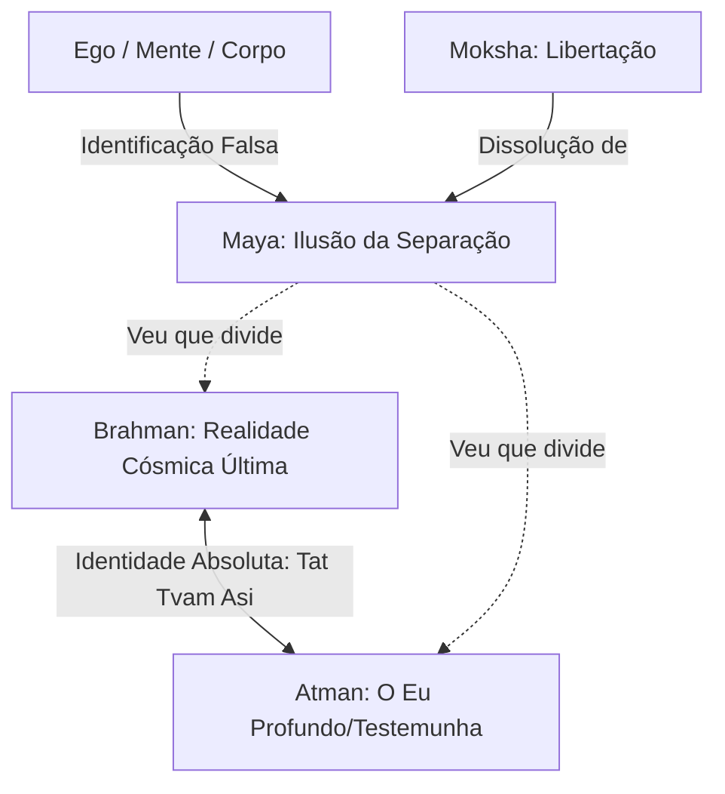

# Curso Mestre dos Pensadores

## Capítulo 02: A Ilusão do Eu: O Segredo de Brahman e Atman nos Upanishads

---

### 1. O Gancho & Título Encantador

Considere uma única gota de chuva caindo das nuvens. Durante sua descida, a gota pode olhar ao redor, comparar-se com outras gotas maiores ou menores, sentir-se solitária e temer sua iminente destruição ao colidir com a terra. Ela se percebe como uma entidade isolada, com uma identidade separada e um destino trágico. No entanto, no instante em que essa gota toca a superfície de um oceano infinito, ela não é aniquilada; ela simplesmente se dissolve e descobre que sempre foi o próprio oceano. A sua separação era apenas uma ilusão temporária da queda.

Este é o cerne dos **Upanishads**, uma coleção de antigos textos filosóficos indianos escritos há quase três milênios. Enquanto a filosofia ocidental frequentemente se debruça sobre a análise lógica do mundo externo e a distinção clara entre o sujeito que observa e o objeto observado, o pensamento upanishádico mergulha diretamente no abismo da subjetividade para revelar um segredo avassalador: o seu eu mais íntimo não é apenas uma mente pensante ou uma identidade biológica isolada. Você, na sua essência mais profunda, é o tecido fundamental de que é feito todo o universo.

Se você já se sentiu desconectado da natureza, isolado em sua própria mente ou aterrorizado pela finitude de sua vida física, os Upanishads oferecem uma revolução copernicana para a alma humana. Eles nos convidam a rasgar o véu da separação e a experimentar a liberdade absoluta de quem descobre que a gota e o oceano são uma única e mesma água.

---

### 2. O Cenário & Contexto Histórico

Para compreender a emergência dos Upanishads, precisamos retroceder à Índia do primeiro milênio a.C., particularmente entre os séculos VIII e V a.C. Esse período se insere no que o filósofo Karl Jaspers chamou de **Era Axial** — um momento crucial da história humana em que, de forma independente na China, na Índia, na Pérsia, na Palestina e na Grécia, surgiram as bases espirituais e filosóficas que ainda hoje sustentam a humanidade.

Antes dos Upanishads, a espiritualidade indiana era dominada pela religiosidade ritualística dos primeiros **Vedas** (como o *Rig Veda*). Essa fase inicial era caracterizada por sacrifícios externos elaborados (*yajnas*) conduzidos pela classe sacerdotal dos brâmanes. O objetivo desses rituais era agradar aos deuses da natureza (como Indra, o deus do trovão, ou Agni, o deus do fogo) para obter prosperidade material, chuvas abundantes e vitórias em guerras.

Contudo, à medida que a sociedade védica se expandia e se urbanizava ao longo do vale do rio Ganges, surgiu uma profunda crise existencial e intelectual. Muitos buscadores começaram a questionar a eficácia e a superficialidade dos sacrifícios animais e dos rituais externos. O que acontece após a morte? Qual é o verdadeiro sentido da vida além dos desejos materiais?

Esses questionadores — frequentemente chamados de *sannyasins* (renunciantes) ou sábios das florestas (*aranyakas*) — abandonaram as cidades e os deveres sociais tradicionais. Eles se retiraram para as selvas e montanhas da Índia para viver em simplicidade meditativa. A palavra **Upanishad** deriva das raízes sânscritas *upa* (perto), *ni* (abaixo) e *sad* (sentar-se), significando literalmente "sentar-se perto, abaixo" de um mestre espiritual para receber ensinamentos secretos e esotéricos.

Os Upanishads representam o clímax filosófico dos Vedas (razão pela qual essa escola de pensamento é conhecida como **Vedanta**, que significa "o fim ou a culminação dos Vedas"). Eles marcam a transição do ritualismo litúrgico externo para a meditação introspectiva e o conhecimento interior (*Jnana*).

---

### 3. O Coração da Obra (Mergulho Profundo)

A filosofia dos Upanishads é vasta e expressa-se através de diálogos, metáforas poéticas e debates metafísicos. No entanto, sua estrutura conceitual repousa sobre a relação dinâmica entre três pilares: *Brahman*, *Atman* e a força ilusória de *Maya*.

#### Brahman: A Realidade Última e Inefável
Os Upanishads buscam definir a substância primordial que sustenta todo o cosmos. Essa substância não é um Deus antropomórfico (com forma humana, raiva ou preferências), mas sim **Brahman**: a realidade última, eterna, infinita, impessoal, imanente e transcendente. Brahman é a própria existência, a fonte não-causada de todas as coisas causadas.

Como Brahman transcende o espaço, o tempo e a causalidade, a linguagem humana racional é incapaz de defini-lo positivamente. Por isso, os sábios usavam o método da negação conhecido como **Neti Neti** ("nem isto, nem aquilo"). Brahman não é a mente, não é a matéria, não é a luz, não é a escuridão. Ao negar todas as características finitas e limitadas, o que resta é a pura consciência infinita. O *Taittiriya Upanishad* descreve Brahman como *Satyam-Jnanam-Anantam*: Verdade, Conhecimento e Infinito.

#### Atman: O Observador Silencioso
Se Brahman é a realidade do macrocosmos, os Upanishads perguntam: qual é a realidade do microcosmos, o eu interior?

Normalmente, quando nos perguntam quem somos, descrevemos nossa mente (pensamentos, memórias, opiniões) ou nosso corpo (aparência, gênero, idade). Os sábios indianos apontam que tudo isso é impermanente e sujeito a mudanças. O corpo envelhece; as emoções flutuam; os pensamentos mudam a cada segundo. Portanto, se essas coisas mudam, elas não podem ser a nossa identidade essencial permanente.

Abaixo do corpo, dos sentidos e da mente pensante, os Upanishads identificam o **Atman**: a alma individual, a consciência pura que testemunha silenciosamente todas as experiências sem ser alterada por elas. Atman é o observador não-afetado, a luz interna que ilumina o palco da nossa mente. Ele não nasce quando o corpo nasce, e não morre quando o corpo falece.

#### Tat Tvam Asi: A Grande Identidade
A descoberta revolucionária dos Upanishads — que constitui o ápice do pensamento oriental — é que **Atman e Brahman são um só**. 

Esta identidade é resumida em quatro grandes sentenças chamadas *Mahavakyas*. A mais célebre delas, encontrada no *Chandogya Upanishad*, é **Tat Tvam Asi**, que se traduz como **"Tu és Isso"**. 
- O **"Tu"** refere-se ao Atman, a sua essência subjetiva mais íntima.
- O **"Isso"** refere-se a Brahman, a realidade cósmica total.
- O **"És"** estabelece uma equivalência ontológica absoluta.

Quando você remove todas as limitações acidentais e ilusórias do seu eu individual (o ego, a história de vida, os medos) e remove as representações parciais do mundo externo, resta apenas uma única Consciência Cósmica. O céu estrelado lá fora e a testemunha silenciosa que o observa de dentro são feitos da mesma substância metafísica.

#### Maya: A Ilusão Cósmica da Fragmentação
Se somos idênticos a Brahman, por que não experimentamos isso o tempo todo? Por que nos sentimos tristes, limitados e separados?

A resposta dos Upanishads é **Maya**. Maya é o poder de ilusão ou projeção cósmica. Ela age como um véu que oculta a unidade fundamental da existência e nos faz perceber o mundo como uma multiplicidade de objetos e seres separados. 

A metáfora clássica é a da corda e da cobra. Imagine que você entra em um quarto escuro e vê uma forma enrolada no canto. Imediatamente, você entra em pânico, seu coração acelera e você grita: "Uma cobra!". No entanto, ao acender a luz, você percebe que era apenas uma corda velha. A cobra nunca esteve lá; era apenas uma projeção mental sobre a realidade da corda. No entanto, enquanto você acreditou que era uma cobra, o seu medo e sofrimento foram absolutamente reais. 

Da mesma forma, projetamos no tecido unitário de Brahman um mundo fragmentado de egos rivais, perigos e isolamento. *Maya* nos faz ver "cobras" onde há apenas a "corda" de Brahman.

#### Samsara e Moksha: O Ciclo e a Libertação
Enquanto vivermos sob o domínio de Maya, identificando-nos com o ego e o corpo, acumulamos **Karma** (ações voluntárias que geram consequências futuras). Essa identificação nos prende ao **Samsara** — o ciclo infinito de mortes e renascimentos, caracterizado por insatisfação e impermanência.

A libertação desse ciclo é chamada de **Moksha**. Moksha não é um local paradisíaco para onde vamos após a morte; é um estado de consciência alcançado no presente (chamado de *Jivanmukti*, a libertação em vida). Moksha ocorre quando a ilusão de Maya é dissipada pela luz do conhecimento intuitivo (*Vidya*). No instante em que o buscador realiza existencialmente a sua identidade com Brahman, o ciclo do karma é quebrado e ele atinge a paz indestrutível da infinitude.

---

### 4. Galeria Mental & Prompts Ilustrativos

#### Descrição 1: O Diagrama da Fogueira Cósmica
Imagine uma ilustração estilizada que retrata a relação entre Atman e Brahman. No centro inferior, há uma fogueira gigantesca e brilhante cujas labaredas têm cores douradas, violetas e azuis profundas. Essa fogueira está rotulada como "Brahman (A Realidade Cósmica Última)". Subindo da fogueira, vemos dezenas de faíscas brilhantes flutuando no ar. Cada faísca individual está envolta em uma pequena bolha esfumaçada cinza, rotulada como "Ego/Maya (A Ilusão da Separação)". Dentro da bolha, a faísca parece isolada e frágil. No topo da ilustração, uma das faíscas rompe a sua bolha cinza; ao fazer isso, ela se expande instantaneamente, transformando-se em uma labareda idêntica em cor e natureza à fogueira central, conectando-se a ela por um feixe de luz pura. Essa transição está marcada como "Moksha (A Libertação / Tat Tvam Asi)".

#### Descrição 2: Prompt de Geração de Imagem (Midjourney / DALL-E 3)
> "A mystical, epic fantasy scene representing the union of Atman and Brahman. A yogi sits in perfect lotus meditation position under a gigantic ancient Banyan tree in a luminous, sacred forest. Faint, glowing Sanskrit characters float around him like fireflies. The yogi's body is translucent, showing a brilliant nebula and galaxies inside his chest, expanding outward and merging seamlessly with the starry night sky and the cosmos above. The lighting is ethereal, with deep indigo, gold, and magenta tones, capturing a feeling of infinite peace and cosmic oneness. Highly detailed, high fantasy art style, spiritual atmosphere, 8k."

---

### 5. Frases de Impacto & O Que Elas Realmente Significam

> "Tu és isso (*Tat Tvam Asi*)."
> — *Chandogya Upanishad*

**O que realmente significa:** Esta é a síntese máxima do pensamento não-dual (*Advaita*). Ela declara que não há abismo intransponível entre o ser humano e o divino, ou entre a criatura e o criador. O absoluto que rege as galáxias é exatamente o mesmo silêncio desperto que reside em seu peito quando você silencia seus pensamentos. A divisão entre o interno e o externo é uma ficção linguística.

> "Aquele que vê todos os seres em si mesmo, e a si mesmo em todos os seres, não conhece mais o medo."
> — *Isha Upanishad*

**O que realmente significa:** A raiz de todo o medo humano, inclusive o medo da morte e da violência do outro, reside na ilusão da separação. Quando percebemos os outros como entidades completamente distintas e alheias a nós, nós os tememos ou os exploramos. Ao perceber a unidade fundamental de todas as consciências, a compaixão torna-se natural e o medo evapora, pois não há "outro" a quem temer ou odiar.

> "Conduza-me do irreal para o Real; conduza-me das trevas para a Luz; conduza-me da morte para a Imortalidade."
> — *Brihadaranyaka Upanishad*

**O que realmente significa:** Este célebre mantra (*Asato ma sadgamaya*) descreve o caminho da jornada espiritual. O "irreal" e a "morte" referem-se à nossa identificação com o mundo físico transitório e o ego mortal (Maya). O "Real" e a "Imortalidade" referem-se à consciência cósmica permanente de Brahman. Não é um pedido de salvação divina externa, mas um clamor pelo despertar da própria consciência.

---

### 6. Paralelos com o Mundo Atual (A Filosofia na Prática)

O século XXI pode ser diagnosticado como a era da **hiperfragmentação do ego**. Vivemos em um ambiente tecnológico que estimula o desenvolvimento exacerbado do individualismo. A cultura do *personal branding*, as métricas de popularidade das redes sociais (seguidores, curtidas, visualizações) e a cobrança constante por performance nos empurram para uma identificação neurótica com a nossa persona pública — a forma definitiva de Maya moderna.

Essa obsessão pelo "Eu" superficial (a biografia pessoal, a aparência física, as posses materiais) gera uma epidemia global de isolamento, ansiedade e depressão. Sentimo-nos como gotas de chuva isoladas, apavoradas com a queda, competindo freneticamente com as outras gotas por espaço no céu.

A filosofia dos Upanishads funciona como uma intervenção de saúde mental urgente. Ela nos ensina que a cura para o isolamento existencial não está em obter mais validação externa para o ego, mas em repousar na consciência silenciosa do Atman. Ao perceber que nossa verdadeira identidade não depende de nossa aprovação algorítmica ou do sucesso financeiro, mas que já somos completos em nossa essência, libertamo-nos do desespero moderno.

Além disso, o pensamento Upanishádico fundamenta uma **ética ecológica integral**. Se a natureza e os animais não são "coisas" externas a serem exploradas por nós, mas partes do mesmo tecido de Brahman que compartilhamos, a destruição do meio ambiente é compreendida como uma autoagressão. O *Tat Tvam Asi* nos convida a olhar para uma floresta ou rio e reconhecer: *Tu és isso*.

---

### 7. Curiosidades e Bastidores

*   **A Paixão de Schopenhauer:** O filósofo alemão do século XIX, Arthur Schopenhauer, teve seu primeiro contato com os Upanishads através de uma tradução em latim (feita a partir de uma tradução persa). O impacto foi avassalador. Ele escreveu: "Tem sido a consolação da minha vida e será a consolação da minha morte". Schopenhauer manteve o livro constantemente em sua mesa de trabalho e realizava uma leitura meditativa do texto todas as noites antes de dormir.
*   **A Física Quântica e os Upanishads:** Vários pais fundadores da física quântica no século XX, como Erwin Schrödinger e Werner Heisenberg, encontraram paralelos profundos entre suas descobertas científicas e o pensamento indiano. Schrödinger, em particular, era um leitor voraz de Vedanta e escreveu ensaios argumentando que a não-dualidade dos Upanishads era a única visão metafísica capaz de conciliar os aparentes paradoxos da física quântica (como a dualidade onda-partícula e a não-localidade).
*   **O Segredo da Floresta:** Originalmente, os Upanishads eram transmitidos apenas oralmente, no dialeto sagrado sânscrito, de mestres a discípulos selecionados. Considerava-se que o ensinamento sobre a unidade cósmica era tão poderoso e revolucionário que, se caísse em mentes despreparadas ou egoístas, poderia causar caos e mal-entendidos. Daí o caráter confidencial da transmissão nas florestas.

---

### 8. A Ponte (Conexão com o Próximo Capítulo)

Os Upanishads abriram as portas para a realização espiritual interna, nos mostrando que a gota de nossa alma é essencialmente o próprio oceano de Brahman. Contudo, na prática cotidiana, a humanidade continuava a sofrer. Saber intelectualmente que *"Tu és isso"* não impedia que as pessoas envelhecessem, ficassem doentes e enfrentassem a morte com desespero. As amarras do Samsara e o peso do sofrimento (*Dukkha*) pareciam fortes demais para a maioria da população.

No século VI a.C., um jovem príncipe indiano chamado Siddhartha Gautama decidiu abandonar os palácios de ouro de sua família para encontrar uma solução definitiva e prática para esse sofrimento universal. 

Contudo, a busca de Siddhartha o levaria a propor um caminho radical e surpreendente. Ao contrário dos sábios upanishádicos que defendiam a existência de um *Atman* eterno e indestrutível dentro de nós, Siddhartha argumentará que a própria crença em uma alma individual permanente é a raiz do nosso apego e, portanto, do nosso sofrimento. 

No próximo capítulo, acompanharemos a jornada do Buda histórico e desvelaremos a força revolucionária de seu ensinamento: as **Quatro Nobres Verdades** e a desconcertante doutrina da vacuidade e do não-eu. Prepare-se para questionar até mesmo a existência da sua própria alma.

---

### 9. Quiz de Fixação e Reflexão

#### Perguntas de Múltipla Escolha

1. **O que significa literalmente a palavra sânscrita "Upanishad"?**
   * A) Sacrifício do fogo sagrado.
   * B) Sentar-se perto, abaixo (de um mestre).
   * C) O ciclo de mortes e renascimentos.
   * D) A canção do Senhor Supremo.

2. **Na metafísica não-dual dos Upanishads, os termos *Atman* e *Brahman* referem-se, respectivamente, a:**
   * A) A alma individual e a Realidade Cósmica Última, que são essencialmente idênticas.
   * B) O deus criador do universo e o ciclo eterno do karma.
   * C) A ilusão sensorial e o método de meditação silenciosa.
   * D) O ego social temporário e a classe sacerdotal védica.

3. **Qual frase em sânscrito sintetiza a revelação máxima dos Upanishads sobre a identidade entre o eu profundo e a realidade cósmica?**
   * A) *Neti Neti*
   * B) *Samsara Moksha*
   * C) *Tat Tvam Asi*
   * D) *Yajna Agni*

4. **A metáfora da corda confundida com uma cobra no escuro serve para ilustrar qual conceito filosófico?**
   * A) *Karma*, pois mostra que nossas ações têm consequências assustadoras.
   * B) *Maya*, revelando como a ilusão nos faz ver fragmentação e perigo onde há apenas a unidade subjacente de Brahman.
   * C) *Moksha*, demonstrando a felicidade de encontrar um réptil valioso.
   * D) *Sannyasa*, simbolizando a necessidade de fugir dos perigos da floresta.

#### Gabarito Comentado

1. **Alternativa Correta: B) Sentar-se perto, abaixo (de um mestre).**
   * *Justificativa:* O termo deriva das raízes *upa* (perto), *ni* (abaixo) e *sad* (sentar), aludindo à atmosfera íntima de transmissão oral do conhecimento místico e filosófico do mestre ao discípulo na Índia antiga.
2. **Alternativa Correta: A) A alma individual e a Realidade Cósmica Última, que são essencialmente idênticas.**
   * *Justificativa:* O Atman é o Eu essencial e testemunha do indivíduo, enquanto Brahman é a essência de todo o cosmos. O coração dos Upanishads reside na revelação de que ambos são a mesma realidade espiritual unitária.
3. **Alternativa Correta: C) *Tat Tvam Asi***. 
   * *Justificativa:* *Tat Tvam Asi* significa "Tu és isso" e proclama a identidade entre o Atman e Brahman. As outras expressões significam: *Neti Neti* (nem isto, nem aquilo - método de negação); *Samsara Moksha* (o ciclo e a libertação); *Yajna Agni* (sacrifício e fogo).
4. **Alternativa Correta: B) *Maya*, revelando como a ilusão nos faz ver fragmentação e perigo onde há apenas a unidade subjacente de Brahman.**
   * *Justificativa:* A cobra não possui existência real própria; ela é apenas uma sobreposição ilusória sobre a corda, que é a verdadeira realidade. Da mesma forma, o mundo de perigos e separações do ego é uma sobreposição ilusória (Maya) sobre Brahman.

#### Pergunta Aberta de Provocação Filosófica
Se a sua identidade profunda (Atman) é idêntica ao tecido de todo o universo (Brahman), como essa perspectiva altera a forma como você lida com as adversidades do cotidiano, com os seus conflitos interpessoais e com o seu medo do envelhecimento e da finitude? Como seria viver sabendo que você é o oceano inteiro, e não apenas a gota de chuva caindo?
