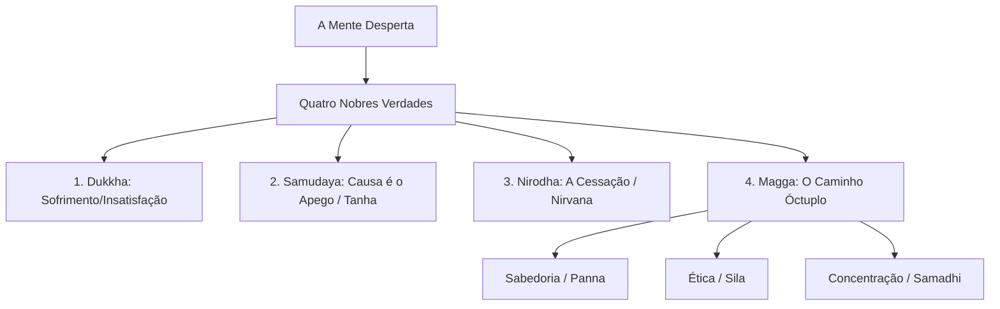

# Curso Mestre dos Pensadores

## Capítulo 03: O Despertar da Ilusão: Siddhartha Gautama, o Sofrimento e a Anatomia da Mente

---

### 1. O Gancho & Título Encantador

Imagine um jovem príncipe cercado de todos os luxos que a imaginação humana poderia conceber. Ele habita três palácios suntuosos — um para o inverno, um para o verão e outro para a estação das chuvas —, todos protegidos por muralhas intransponíveis. Nesses recintos, o sofrimento é terminantemente proibido. Os criados são todos jovens e belos; as flores secas são recolhidas antes que o sol as queime; menestréis e dançarinas animam os salões dia e noite. A velhice, a doença e a morte não são apenas tabus; elas simplesmente não existem na realidade artificialmente construída para o jovem Siddhartha Gautama.

No entanto, o destino da humanidade exigia que esse véu dourado fosse rasgado. Movido por uma curiosidade inquieta, Siddhartha decide, em segredo, passear de carruagem além dos muros do palácio de Kapilavastu. Ali, em quatro saídas sucessivas, ele se depara com quatro visões que mudariam o curso da sua vida e da história espiritual da Terra:
1.  Um **homem idoso**, curvado, trêmulo e frágil pelo peso dos anos.
2.  Um **homem enfermo**, agonizante, consumido pela febre e pela dor.
3.  Um **cadáver** sendo levado para a cremação, seguido por parentes em prantos.
4.  Um **asceta errante**, que, apesar de não possuir nada além de uma tigela de esmolas, irradiava uma paz interna inabalável.

Ao perceber que a velhice, a doença e a morte eram o destino inevitável de todos os seres humanos — incluindo ele próprio e as pessoas que amava —, a suntuosidade de seus palácios transformou-se instantaneamente em uma prisão de mentiras. 

A filosofia de Siddhartha Gautama, que se tornaria conhecido como o **Buda** (o Desperto), não nasce de especulações metafísicas abstratas sobre a origem do universo, mas sim de um diagnóstico clínico urgente sobre o sofrimento existencial da humanidade. O budismo original não se apresenta como uma religião de dogmas divinos, mas sim como uma psicologia terapêutica radical, projetada para curar a mente humana de suas próprias ilusões e dores.

---

### 2. O Cenário & Contexto Histórico

Para compreender a revolução búdica, devemos nos situar no século VI a.C. nos vales do norte da Índia e do atual Nepal. Esta era uma época de profunda agitação social e política. A região estava passando pela chamada "segunda urbanização" do subcontinente indiano. As velhas estruturas tribais e agrárias estavam dando lugar a reinos centralizados de poder e a dinâmicas cidades comerciais.

Essas transformações econômicas vieram acompanhadas de uma crise nas estruturas religiosas tradicionais. A religião dos antigos Vedas, dominada pela casta dos sacerdotes brâmanes, mantinha um sistema rígido de estratificação social e rituais caros. A salvação e a harmonia cósmica dependiam estritamente dos sacrifícios formais executados pelos brâmanes.

Esse monopólio ritualístico gerou uma contracultura de contestação intelectual conhecida como o movimento **Shramana** (da raiz sânscrita *shram*, que significa "esforçar-se" ou "realizar austeridades"). Os shramanas eram ascetas errantes, filósofos da floresta que rejeitavam categoricamente a autoridade dos Vedas e o sistema de castas. Eles buscavam a verdade espiritual através de métodos experimentais pessoais: ioga, jejuns extremos, discussões filosóficas públicas e meditação introspectiva. O Budismo, assim como o Jainismo e outras seitas materialistas e céticas da época, nasceu deste fervilhante caldeirão contracultural shramana.

Siddhartha Gautama nasceu por volta de 563 a.C. em Lumbini, filho de Shuddhodana, o governante da república oligárquica de Shakya. Ao abandonar seu reino aos 29 anos, ele se integrou a esse movimento shramana, disposta a experimentar todas as técnicas de ascese física e meditação conhecidas na Índia de então para encontrar a cura definitiva para o sofrimento humano.

---

### 3. O Coração da Obra (Mergulho Profundo)

#### O Caminho do Meio (*Madhyamika*)
Durante seis anos após sua fuga do palácio, Siddhartha submeteu-se a práticas ascéticas severas na floresta de Uruvela. Ele passou a alimentar-se de um único grão de arroz ou semente de gergelim por dia, reduzindo seu corpo a um esqueleto vivo. Contudo, ele percebeu que a debilitação física extrema não levava ao despertar intelectual; pelo contrário, apenas enevoava a mente com a dor física e a exaustão.

Foi nesse momento limite que Siddhartha recordou uma metáfora musical simples, inspirada na afinação de um alaúde:
- Se as cordas do instrumento forem esticadas demais, elas arrebentam.
- Se as cordas ficarem muito frouxas, elas não produzem som algum.
- A afinação perfeita reside no equilíbrio, na tensão exata da corda.

Siddhartha formulou então o **Caminho do Meio** (*Madhyamika*): a compreensão de que a libertação espiritual não reside no hedonismo luxuoso (a vida que tinha no palácio), nem no ascetismo autodestrutivo (a vida na floresta). O verdadeiro caminho é o equilíbrio dinâmico que mantém o corpo saudável e a mente clara. Sentando-se sob uma árvore Banyan (que ficaria conhecida como a árvore *Bodhi*, ou árvore do despertar), ele meditou profundamente até transpor as barreiras da ilusão e alcançar o *Nirvana* (a extinção dos fogos do apego e da ilusão).

#### As Quatro Nobres Verdades (*Chatvari Arya Satyani*)
O primeiro sermão do Buda após seu despertar, proferido no Parque das Gazelas em Sarnath, estabelece a estrutura lógica de toda a sua filosofia através das Quatro Nobres Verdades, desenhadas de acordo com o modelo de um diagnóstico médico clássico:

1.  **Dukkha (A Verdade do Sofrimento):** *O Diagnóstico.*
    A vida mundana é permeada por *Dukkha*. Frequentemente traduzido como "sofrimento", o termo tem um sentido mais sutil: **insatisfação existencial**, imperfeição, fricção ou desajuste. Buda aponta que o nascimento é *dukkha*, o envelhecimento é *dukkha*, a doença é *dukkha*, a morte é *dukkha*. Associar-se com o que não gostamos é *dukkha*; separar-se do que amamos é *dukkha*; não obter o que desejamos é *dukkha*. Mesmo as experiências felizes são potencialmente *dukkha*, porque são impermanentes e sua inevitável perda nos causa sofrimento.
2.  **Samudaya (A Verdade da Origem de Dukkha):** *A Causa.*
    A causa de *dukkha* não é uma punição divina ou o azar material. A causa está dentro da nossa própria estrutura psicológica: é o **desejo insaciável** ou a sede crônica (*Tanha*). Nossa mente vive em um estado de carência perpétua. Queremos nos apegar aos prazeres sensoriais, à nossa juventude, à nossa vida e às nossas opiniões. Quando o mundo muda (como inevitavelmente muda devido à impermanência), nós sofremos. O apego (*Upadana*) e a aversão ao que nos desagrada, gerados pela ignorância fundamental (*Avidya*) sobre a verdadeira natureza da realidade, são a origem de nossa dor.
3.  **Nirodha (A Verdade da Cessação de Dukkha):** *O Prognóstico.*
    O sofrimento pode ser extinto. Há uma cura para a insatisfação. Essa cessação é o **Nirvana** (literalmente, "soprar" ou "extinguir" a chama de um fogo). O Nirvana é a extinção dos três "fogos venenosos" da mente: a ganância (*raga*), o ódio (*dvesha*) e a ilusão (*moha*). Quando paramos de projetar carências infinitas nas coisas finitas do mundo, a mente atinge uma paz inabalável e fria como um fogo extinto.
4.  **Magga (A Verdade do Caminho):** *A Prescrição.*
    Para alcançar o Nirvana, o Buda prescreve uma terapia prática e sistemática chamada **O Caminho Óctuplo** (ou o Caminho de Oito Passos). Esse caminho é tradicionalmente dividido em três grandes pilares:
    *   **Sabedoria (Panna):** Compreensão Correta e Pensamento Correto.
    *   **Conduta Ética (Sila):** Fala Correta, Ação Correta e Meio de Vida Correto.
    *   **Treinamento Mental (Samadhi):** Esforço Correto, Atenção Plena Correta (*Sati / Mindfulness*) e Concentração Correta.

#### As Três Marcas da Existência (*Trilaksana*)
Para compreender por que o apego causa sofrimento, Buda aponta que toda a realidade fenomênica é caracterizada por três marcas indissolúveis:
1.  **Anicca (Impermanência):** Tudo o que é composto de partes está em constante fluxo e transformação. Nada permanece idêntico a si mesmo por dois instantes consecutivos. Galáxias, pensamentos e corpos físicos nascem, mudam e desaparecem.
2.  **Dukkha (Insatisfatoriedade):** Por causa de *Anicca*, nada no mundo fenomênico pode oferecer uma âncora de segurança absoluta ou felicidade eterna.
3.  **Anatta (O Não-Eu / Não-Alma):** Esta é a doutrina mais radical e revolucionária do Budismo. Em oposição direta à doutrina védica e upanishádica de um *Atman* (uma alma individual imutável e eterna), Buda declara que **não existe um Eu sólido, permanente ou substancial**. 

O que chamamos de "Eu" ou "minha mente" é apenas um fluxo contínuo de cinco componentes psicofísicos dinâmicos e impermanentes conhecidos como os **Cinco Skandhas** (Cinco Agregados):
- A **Forma Física** (o corpo físico e os sentidos).
- A **Sensação** (a reação imediata de agradável, desagradável ou neutro diante das experiências).
- A **Percepção** (o reconhecimento e rotulagem das experiências: "isto é uma flor", "isto é dor").
- As **Formações Mentais** (nossos pensamentos, reações habituais, preconceitos, desejos e intenções).
- A **Consciência** (a cognição ou awareness básica dos objetos sensoriais).

Esses cinco agregados fluem juntos como as águas de um rio. Assim como o rio não é um objeto sólido estático, mas sim o próprio fluxo constante da água, o "Eu" não é uma alma estática, mas o fluxo dinâmico dos Skandhas. O sofrimento surge quando tentamos congelar esse rio, apegando-nos a uma identidade fixa e imutável que a realidade nega a cada segundo.

---

### 4. Galeria Mental & Prompts Ilustrativos

#### Descrição 1: O Diagrama do Rio dos Cinco Skandhas
Imagine um infográfico conceitual desenhado em tons aquarela. No topo, uma grande montanha rochosa representa o mundo externo. Da montanha, desce um rio caudaloso e veloz composto por cinco correntes de águas coloridas que se entrelaçam constantemente. Cada corrente tem uma cor e um rótulo flutuante:
- A corrente azul representa a **Forma Física** (moléculas, órgãos, sentidos).
- A corrente verde representa as **Sensações** (agradável/desagradável).
- A corrente amarela representa as **Percepções** (rótulos e nomes).
- A corrente vermelha representa as **Formações Mentais** (pensamentos e reações).
- A corrente violeta representa a **Consciência** (o ato de testemunhar).

No meio do rio, há uma mão humana que tenta agarrar um punhado de água corrente com força, gerando redemoinhos de espuma e turbulência. Essa mão está rotulada como "Ego / Apego (*Tanha*)", e a turbulência gerada ao redor dela é rotulada como "*Dukkha* (Sofrimento)". No final do rio, as águas correm suavemente para uma bacia de lagoa perfeitamente espelhada, sem ondas ou turbulências, rotulada como "Nirvana".

#### Descrição 2: Prompt de Geração de Imagem (Midjourney / DALL-E 3)
> "A cinematic and spiritually powerful scene representing the awakening of Buddha. Gautama Buddha sits in serene meditation under the branches of a massive, ancient Bodhi tree with luminous golden-green leaves. His expression is one of infinite tranquility, peace, and non-attachment. Around him, shadowy figures representing the demon Mara's illusions, temptations, and terrors dissolve like smoke in the presence of dawn. A soft, warm, golden light radiates outward from Buddha's heart, casting gentle shadows. The style is detailed realism with a touch of mystical impressionism, high contrast, warm and cool color palette, 8k resolution."

---

### 5. Frases de Impacto & O Que Elas Realmente Significam

> "O sofrimento é inevitável; a dor é inevitável, mas o sofrimento é opcional."
> — *Máxima derivada do cânone budista*

**O que realmente significa:** A dor física ou a perda externa (velhice, doença, perdas financeiras) são dados brutos da realidade natural da existência humana. No entanto, o sofrimento (*Dukkha*) é a nossa reação mental psicológica de resistência e não-aceitação diante dessa dor. Se resistimos à realidade ("não deveria ser assim", "por que comigo?"), multiplicamos a dor inicial. Se aceitamos a realidade de forma lúcida e sem apegos, eliminamos a segunda camada de sofrimento subjetivo.

> "Como a chuva penetra numa cabana mal coberta, assim a paixão penetra na mente não treinada."
> — *Dhammapada, Verso 13*

**O que realmente significa:** A mente destreinada e sem atenção plena (*Mindfulness*) é porosa e vulnerável às reações automáticas de raiva, ganância e medo induzidas pelo ambiente externo. O treinamento meditativo não serve para construir muros de frieza emocional, mas para restaurar a integridade da "cabana" mental, impedindo que os impulsos automáticos inundem a nossa consciência e guiem nossas ações de forma cega.

> "Tudo o que é composto está sujeito à decadência. Esforcem-se pela própria libertação com diligência."
> — *Mahaparinibbana Sutta (As últimas palavras do Buda)*

**O que realmente significa:** Esta frase condensa a doutrina de *Anicca* (impermanência). Tudo o que foi criado por condições físicas ou mentais irá um dia acabar. Não há salvadores externos ou rituais mágicos que possam nos poupar desse fato. O Buda enfatiza a responsabilidade pessoal de cada indivíduo para estudar a própria mente e alcançar o despertar através do próprio esforço ético e meditativo.

---

### 6. Paralelos com o Mundo Atual (A Filosofia na Prática)

O diagnóstico feito pelo Buda há 2500 anos nunca foi tão preciso quanto no século XXI. A economia moderna do consumo opera como uma gigantesca "máquina de fabricar desejos insaciáveis" (*Tanha*). O marketing contemporâneo não vende apenas produtos físicos; ele vende a ilusão de que a aquisição do próximo produto (o smartphone de última geração, o carro do ano, o corpo perfeito das redes sociais) trará a felicidade definitiva e estancará nossa insatisfação interna.

Esse mecanismo nos coloca em uma "esteira hedônica": compramos o objeto, sentimos um breve pico de prazer, a impermanência atua (o objeto quebra, sai de moda ou nos acostumamos com ele) e voltamos ao estado basal de vazio existencial, gerando um novo ciclo de consumo. O capitalismo de plataforma se nutre da nossa constante busca por dopamina barata.

Nesse cenário, as técnicas budistas de **Atenção Plena (Mindfulness)**, despidas de seu caráter religioso e aplicadas pela psicologia cognitiva moderna, tornaram-se ferramentas clínicas essenciais contra transtornos de ansiedade, estresse e depressão. 

Praticar a atenção plena hoje é um ato de resistência existencial. Significa treinar a mente para observar o fluxo constante dos *Skandhas* sem ser arrastado por eles. Quando sentimos a urgência de checar o celular por causa de uma notificação, a atenção plena nos permite observar a sensação física do desejo surgindo, mudando e desaparecendo, sem que tenhamos que agir automaticamente conforme o impulso. Libertamo-nos, assim, do automatismo de nossas reações.

---

### 7. Curiosidades e Bastidores

*   **O Buda Silencioso sobre Deus:** Quando os filósofos de sua época pressionavam o Buda com perguntas metafísicas especulativas (como "O universo é eterno ou finito?", "Existe vida após a morte para quem atingiu o Nirvana?", "Deus existe?"), o Buda frequentemente respondia com um silêncio nobre. Ele comparava essas perguntas à atitude de um homem que foi atingido por uma flecha envenenada e, em vez de permitir que o médico retire a flecha, exige saber antes: "Quem atirou a flecha? De que casta ele é? De que madeira é feito o arco?". Esse homem morreria antes de obter as respostas. Para o Buda, curar o sofrimento humano era a única prioridade prática.
*   **O Demônio Interno:** Mara, a divindade budista que tenta impedir Siddhartha de alcançar a iluminação, é frequentemente interpretado na psicologia budista não como uma entidade externa real, mas como a personificação de nossas próprias sombras psicológicas: o medo da morte, o apego ao prazer material, a dúvida existencial e o apego ao ego.
*   **O Desafio ao Sistema:** O Buda aceitou em sua ordem monástica (*Sangha*) pessoas de todas as castas, desde reis e brâmanes até párias intocáveis, varredores de rua e mulheres. Numa Índia profundamente hierarquizada, essa atitude foi uma revolução social sem precedentes.

---

### 8. A Ponte (Conexão com o Próximo Capítulo)

Siddhartha Gautama nos ofereceu um método estruturado e exigente para desconstruir o ego e alcançar a libertação através do esforço ético e mental consciente. O Caminho Óctuplo exige vigilância constante sobre as nossas intenções, falas, ações e pensamentos. Trata-se de uma verdadeira ginástica espiritual para domar a mente indômita.

Contudo, na mesma época em que o budismo florescia na Índia, do outro lado das montanhas do Himalaia, na China Imperial, os sábios começavam a fazer perguntas diferentes. E se o esforço excessivo para controlar a mente for, em si mesmo, uma manifestação de apego e ego? E se a tentativa obstinada de nos tornarmos "iluminados" apenas criasse mais tensão e sofrimento?

O misterioso sábio chinês Lao Tzu proporá um caminho alternativo e revolucionário baseado no abandono de todo esforço rígido. Em vez de lutar para domar a mente como quem rema contra a correnteza de um rio caudaloso, o Taoísmo nos ensinará a deitar de costas na água e permitir que a corrente do universo (**O Tao**) nos guie naturalmente. 

No próximo capítulo, entraremos no universo poético e paradoxal de **Lao Tzu e o Taoísmo**, explorando o poder da suavidade, da não-ação ativa (**Wu Wei**) e o mistério do fluxo do Caminho. Prepare-se para descobrir a força oculta da água que vence a rocha sem fazer esforço algum.

---

### 9. Quiz de Fixação e Reflexão

#### Perguntas de Múltipla Escolha

1. **Quais foram as quatro visões fora das muralhas do palácio que motivaram Siddhartha Gautama a iniciar sua busca espiritual?**
   * A) Um guerreiro, um rei, um sacerdote e um camponês.
   * B) Um velho, um doente, um cadáver e um asceta.
   * C) Uma tempestade, um eclipse, um terremoto e uma seca.
   * D) Um templo de ouro, uma árvore sagrada, um rio seco e um monge rico.

2. **Na Segunda Nobre Verdade (*Samudaya*), qual é identificada como a principal causa da insatisfação humana e do sofrimento (*Dukkha*)?**
   * A) A imperfeição inerente das condições climáticas e naturais.
   * B) O castigo cármico imposto pelas divindades iradas do panteão hindu.
   * C) O desejo insaciável ou sede (*Tanha*), enraizado na ignorância e no apego à impermanência.
   * D) A falta de dedicação aos rituais de sacrifício promovidos pelos sacerdotes.

3. **Qual é a doutrina budista que nega categoricamente a existência de uma alma individual eterna e imutável (*Atman*)?**
   * A) *Anicca* (Impermanência)
   * B) *Dharma* (A Lei Natural)
   * C) *Anatta* (Não-Eu)
   * D) *Sangha* (A Comunidade)

4. **A metáfora budista do afinamento do alaúde serve para ilustrar qual conceito filosófico básico?**
   * A) O Caminho do Meio (*Madhyamika*), que rejeita tanto o hedonismo quanto o ascetismo extremo.
   * B) O Caminho Óctuplo como uma progressão musical harmoniosa.
   * C) A impermanência de todas as artes e prazeres sonoros.
   * D) A necessidade de isolar-se na floresta para aprender a tocar instrumentos.

#### Gabarito Comentado

1. **Alternativa Correta: B) Um velho, um doente, um cadáver e um asceta.**
   * *Justificativa:* Estas quatro visões confrontaram o príncipe com as verdades inevitáveis da fragilidade humana (velhice e doença), da mortalidade (cadáver) e da possibilidade de superação pacífica da dor por meio da busca interna (asceta).
2. **Alternativa Correta: C) O desejo insaciável ou sede (*Tanha*), enraizado na ignorância e no apego à impermanência.**
   * *Justificativa:* O budismo localiza a causa da dor na nossa incapacidade de lidar com a mudança das coisas, gerando um apego desesperado (*Tanha*) a formas impermanentes. As outras alternativas representam visões míticas ou naturalistas que o Buda rejeitou.
3. **Alternativa Correta: C) *Anatta* (Não-Eu).**
   * *Justificativa:* *Anatta* (ou *Anatman* em sânscrito) é a negação de um Eu permanente e imutável. *Anicca* (A) é a impermanência universal; *Dharma* (B) é o ensinamento ou lei universal; *Sangha* (D) é a comunidade de praticantes.
4. **Alternativa Correta: A) O Caminho do Meio (*Madhyamika*), que rejeita tanto o hedonismo quanto o ascetismo extremo.**
   * *Justificativa:* O alaúde não soa bem se a corda estiver excessivamente apertada (analogia com a ascese extrema que destrói o corpo) ou muito frouxa (analogia com o luxo excessivo que anestesia a mente). A libertação exige o equilíbrio.

#### Pergunta Aberta de Provocação Filosófica
Observe a sua própria vida cotidiana: identifique qual é o seu principal "apego" ou "sede" (*Tanha*) atual (pode ser o reconhecimento profissional, a necessidade de controle, a busca por distração digital ou o apego a um determinado status). Como esse apego específico gera fricção ou insatisfação (*Dukkha*) quando as circunstâncias da vida mudam contra a sua vontade? Como a prática do "não-apego" poderia trazer mais paz às suas relações cotidianas?
