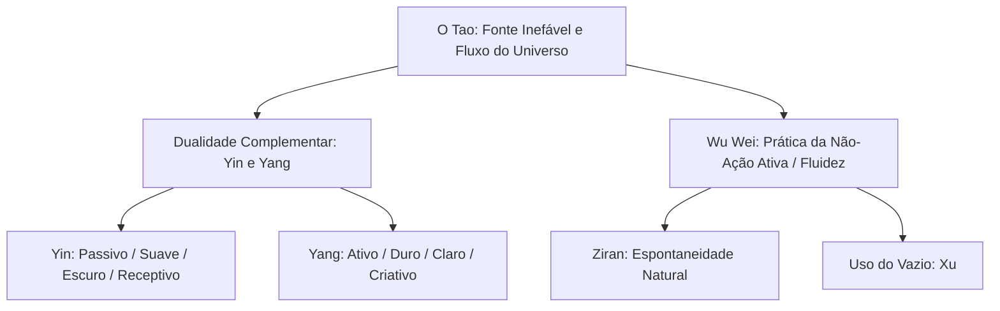

# Curso Mestre dos Pensadores

## Capítulo 04: A Força do Vazio: Lao Tzu, o Fluxo do Tao e a Arte da Não-Ação (Wu Wei)

---

### 1. O Gancho & Título Encantador

Considere a água. Não há nada no mundo mais suave, mole e adaptável. Se você tentar cortá-la com uma espada, ela se esquiva sem sofrer uma única cicatriz; se você a derramar em uma jarra, ela assume o formato da jarra; se ela encontra uma rocha em seu curso, ela não a ataca de frente com fúria, mas contorna-a com paciência e suavidade, continuando sua descida em direção ao mar. No entanto, se você der tempo à água mole, ela escavará o cânion mais profundo e destruirá a rocha mais sólida da Terra. A água vence o que é duro não pela força bruta, mas pela persistência da sua flexibilidade.

Este paradoxo da suavidade que vence a rigidez é o alicerce do **Taoísmo**, corrente filosófica chinesa tradicionalmente atribuída ao enigmático sábio **Lao Tzu**. Em um mundo dominado pela obsessão pelo controle, pelo esforço extenuante e pela busca incessante de resultados e poder, Lao Tzu nos convida a fazer uma pausa radical. Ele nos adverte que nossa mania de forçar as circunstâncias da vida para moldá-las aos nossos desejos egóicos é, na verdade, a fonte de nossa exaustão e de nossos fracassos.

A filosofia taoísta propõe uma arte de viver baseada na harmonia espontânea com o universo. Trata-se da arte do **Wu Wei** (a não-ação ativa). Longe de ser um apelo à preguiça ou à apatia, o *Wu Wei* é a sabedoria de agir sem esforço artificial, alinhando nossas ações com o fluxo profundo e invisível da natureza — **O Tao**. Se você se sente exausto por remar constantemente contra a correnteza das coisas, Lao Tzu nos ensina a erguer os remos e a usar a própria força do rio para navegar com graça.

---

### 2. O Cenário & Contexto Histórico

Para compreender a mensagem do *Tao Te Ching* (o livro clássico do Taoísmo), precisamos viajar à China antiga do período conhecido como **Primavera e Outono** (770–476 a.C.), uma fase de transição tumultuada que culminaria no sangrento período dos **Estados Beligerantes**. A outrora estável Dinastia Zhou estava em declínio acelerado, e o território chinês fragmentava-se em dezenas de principados rivais que guerreavam sem trégua por terras e hegemonia política.

Esse cenário de caos militar, traição dinástica e sofrimento popular provocou uma crise de valores sem precedentes. As velhas certezas morais haviam desmoronado. Diante do colapso social, os intelectuais chineses dividiram-se na busca de soluções para restaurar a ordem e a paz. Esse período ficou conhecido como a era das **Cem Escolas de Pensamento**.

Nesse debate público, destacaram-se duas grandes correntes filosóficas rivais e complementares:
- **O Confucionismo:** Fundado por Confúcio (Kong Fuzi), propunha que a harmonia social só poderia ser restaurada através do estabelecimento rigoroso de normas morais, rituais sagrados (*Li*), deveres filiais, hierarquia rígida e educação clássica. Para Confúcio, a paz dependia do esforço ativo de retificação moral da sociedade.
- **O Taoísmo:** Reagindo a essa visão confucionista, Lao Tzu e seus seguidores argumentavam que o excesso de regras, leis artificiais e convenções morais era a causa real da corrupção e do sofrimento humano. Para os taoístas, quanto mais regras e restrições existiam no império, mais rebeldes e ladrões surgiam. A solução não era criar mais rituais artificiais, mas retornar ao estado de simplicidade original e sintonia com a natureza.

A lenda conta que Lao Tzu (que significa literalmente "O Velho Mestre") trabalhou como arquivista real na corte dos Zhou. Desiludido com a decadência ética e a insensatez da corte, ele decidiu abandonar o império montado em um búfalo de água azul-cinzento, viajando rumo ao oeste selvagem. Ao cruzar o passo da montanha de Hangu, o guardião da fronteira reconheceu o sábio e implorou para que ele registrasse sua sabedoria antes de partir para sempre. Lao Tzu concordou e escreveu em poucos dias o **Tao Te Ching** (*O Livro do Caminho e de sua Virtude*), um texto de apenas 5.000 caracteres chineses repletos de aforismos paradoxais e poéticos. Após entregar o rolo, ele partiu e sumiu na névoa do horizonte, sem que ninguém jamais soubesse onde terminou seus dias.

---

### 3. O Coração da Obra (Mergulho Profundo)

A filosofia taoísta repousa sobre uma tríade conceitual interconectada: o *Tao*, o *Yin-Yang* e o princípio prático do *Wu Wei*.

#### O Tao: O Princípio Sem Nome
A primeira linha do *Tao Te Ching* estabelece imediatamente o limite da razão humana: *"O Tao que pode ser dito não é o Tao eterno; o nome que pode ser nomeado não é o nome eterno"*. 

O **Tao** (geralmente traduzido como "Caminho") é a realidade última e inefável que antecede e gera todas as coisas do universo físico. Ele não é um deus pessoal com vontade própria, mas a própria lei imanente que governa o movimento do cosmos. O Tao é silencioso, invisível, mas sua operação é contínua e universal. É o mistério que faz as sementes germinarem, as estrelas orbitarem e as estações mudarem sem que haja uma inteligência coordenadora visível.

Como o Tao é a totalidade de tudo o que existe e o vazio primordial de onde a existência brota, defini-lo com palavras é limitá-lo. O sábio taoísta aceita o limite da linguagem e prefere apontar para o Tao através de metáforas naturais como a água, o vale fértil, a mãe receptiva ou a madeira bruta não entalhada (*Pu*).

#### Yin e Yang: A Dança dos Opostos
Para o Taoísmo, o universo não é composto por elementos estáticos em conflito moral entre "bem" e "mal". A realidade fenomênica é gerada pela interação dinâmica e cíclica de duas forças polares, complementares e interdependentes conhecidas como **Yin** e **Yang**:
- **Yin:** O aspecto escuro, frio, passivo, receptivo, intuitivo, feminino e flexível da existência. É representado pelo vale, pela terra, pela água e pelo repouso.
- **Yang:** O aspecto claro, quente, ativo, penetrante, racional, masculino e rígido da existência. É representado pela montanha, pelo céu, pelo fogo e pelo movimento.

Nenhuma força é intrinsecamente superior à outra; a saúde do cosmos e do indivíduo depende do equilíbrio dinâmico entre ambas. O símbolo clássico do *Taijitu* (o círculo dividido em duas metades sinuosas preta e branca, contendo cada uma um ponto da cor oposta) mostra que a semente do Yin já reside no ápice do Yang e vice-versa. Quando o Yang (a atividade) chega ao seu extremo, ele naturalmente se transforma em Yin (o descanso). Quem tenta viver apenas em Yang (ação contínua, produtividade incessante) acaba desabando na exaustão.

#### Wu Wei: A Ação sem Esforço
O conceito mais pragmático e frequentemente mal compreendido do Taoísmo é o **Wu Wei** (não-ação ou não-interferência). O ideograma chinês *Wu* significa "não ter" ou "ausência", e *Wei* significa "ação", "esforço" ou "forçar".

*Wu Wei* não prega a inércia, a passividade preguiçosa ou o conformismo. Significa **agir de acordo com o curso natural das coisas**, sem impor uma vontade artificial, agressiva ou egóica às circunstâncias. É o agir que parece não-agir porque está perfeitamente alinhado com a dinâmica natural da situação.

Pense em um nadador experiente que cai em uma forte correnteza:
- O nadador destreinado entra em pânico e rema contra a correnteza com todas as forças (Yang extremo). Ele se cansa rapidamente e corre risco de afogamento. Isso é a ação artificial e contra o fluxo.
- O nadador adepto do *Wu Wei* não desiste de viver (isso seria inércia). Ele flutua de costas, observa a correnteza e nada diagonalmente em direção à margem aproveitando a própria velocidade do rio. Ele alcança a segurança economizando energia.

O *Wu Wei* é a ação espontânea que surge do silêncio interior. Quando um artista pinta em estado de inspiração pura (o que a psicologia moderna chama de "estado de Flow"), ou quando um atleta executa um movimento perfeito sem pensar nos passos técnicos, eles estão praticando o *Wu Wei*. A mente racional de controle recua, permitindo que a inteligência natural do corpo e do ambiente tome a liderança.

#### O Elogio do Vazio (*Xu*)
Lao Tzu destaca a enorme utilidade do não-ser e do vazio na vida humana. No capítulo 11 do *Tao Te Ching*, ele escreve:
> "Trinta raios unem-se no cubo de uma roda; mas é o seu vazio central que permite à carruagem mover-se.
> Molda-se o barro para fazer um vaso; mas é o seu vazio interno que permite conter a água.
> Abrem-se portas e janelas para construir uma casa; mas é o seu vazio que a torna habitável.
> Portanto, o ser traz benefícios, mas é o Não-Ser que cria a utilidade."

Nossa sociedade ocidental valoriza obsessivamente o acúmulo: encher a agenda, encher a mente de informações, acumular bens. Lao Tzu nos lembra de que o que dá valor às coisas é o espaço vazio dentro delas. Uma mente superlotada de preconceitos e planos rígidos não tem espaço para aprender ou para receber a sabedoria espontânea do momento.

---

### 4. Galeria Mental & Prompts Ilustrativos

#### Descrição 1: O Diagrama do Bambu e do Carvalho
Imagine um diagrama desenhado no estilo de uma pintura clássica em nanquim chinês. A imagem é dividida em duas metades sob uma tempestade de neve e vento severos. Do lado esquerdo, vemos um grande carvalho imponente, com tronco largo e galhos grossos e rígidos, rotulado como "Rigidez / Yang Extremo (Esforço Artificial)". Sob a força do vento e o acúmulo de neve, um dos grandes galhos do carvalho racha e quebra bruscamente com um letreiro explicativo: "Quebra sob a pressão". Do lado direito, vemos um caule fino de bambu verde e flexível, rotulado como "Flexibilidade / Yin (Wu Wei)". Sob a mesma tempestade de vento, o bambu se curva profundamente até tocar o chão, deixando a neve deslizar suavemente de suas folhas. Uma vez que o vento passa, o bambu retorna ereto, intacto e forte com o letreiro: "Dobra-se para vencer". Abaixo da ilustração, lê-se o aforismo: "O rígido quebra; o flexível resiste".

#### Descrição 2: Prompt de Geração de Imagem (Midjourney / DALL-E 3)
> "An ancient Chinese landscape painting in a traditional sumi-e ink wash style. A serene old sage with a long white beard, wearing flowing robes, sits quietly on the back of a large dark water buffalo. They are slowly traveling through a high mountain pass shrouded in misty fog and ancient pine trees. Faint golden light from the setting sun breaks through the clouds. The mood is peaceful, silent, and deeply harmonious with nature. High quality brush strokes, rich texture of paper, monochrome with subtle touches of gold, masterpiece."

---

### 5. Frases de Impacto & O Que Elas Realmente Significam

> "O Tao nada faz, contudo, nada fica sem fazer."
> — *Tao Te Ching, Capítulo 37*

**O que realmente significa:** Esta frase parece um paradoxo absurdo, mas descreve a eficiência suprema do fluxo natural. A natureza não faz planos de negócios, não usa agendas e não corre contra o relógio. No entanto, tudo é realizado no momento certo: as florestas crescem, os rios correm e os planetas giram. O agir do Tao é invisível, mas absoluto. Agir sob o *Wu Wei* é atingir resultados sem a necessidade de intervenções forçadas e estressantes.

> "Aquele que muito sabe cala-se; aquele que muito fala ignora."
> — *Tao Te Ching, Capítulo 56*

**O que realmente significa:** A verdadeira sabedoria para o Taoísmo é de ordem intuitiva, vivencial e direta, não podendo ser capturada por discursos lógicos intermináveis ou debates intelectuais barulhentos. Quem tenta provar sua inteligência através do debate constante mostra que ainda está preso à vaidade do ego e à separação mental, desconectado do silêncio essencial do Tao.

> "O que é flexível e mole é companheiro da vida. O que é rígido e duro é companheiro da morte."
> — *Tao Te Ching, Capítulo 76*

**O que realmente significa:** Observe o corpo humano: quando nascemos, somos extremamente moles e maleáveis; quando morremos, tornamo-nos frios e rígidos. Uma árvore viva é verde e flexível; quando seca e morre, torna-se dura e quebra com facilidade. A flexibilidade mental e emocional (a capacidade de mudar de opinião, de se adaptar às novas circunstâncias e de aceitar o fluxo da vida) é o sinal do vigor da vida. A teimosia e a rigidez intelectual são sintomas de morte espiritual precoce.

---

### 6. Paralelos com o Mundo Atual (A Filosofia na Prática)

Vivemos na sociedade do cansaço, como descreve o filósofo contemporâneo Byung-Chul Han. Somos cobrados por uma alta performance constante sob a lógica da hiperatividade: precisamos ser proativos, multitarefas, focar em metas e planos de carreira milimetricamente calculados. O lema moderno é o esforço extremo.

Esse estado de alerta contínuo gerou uma epidemia global de **burnout**, depressão e transtornos de ansiedade. Nós esquecemos a utilidade do vazio. Nossas mentes e agendas estão tão entupidas de tarefas que não há espaço para a contemplação ou para a criatividade espontânea.

A filosofia do *Wu Wei* é um antídoto direto a essa loucura moderna. Ela pode ser aplicada na prática através de três atitudes:
1.  **Cultivar a paciência ativa:** Compreender que cada processo na vida tem seu próprio tempo de maturação. Forçar uma decisão ou um projeto antes do tempo é o mesmo que puxar as folhas de uma planta para fazê-la crescer mais rápido; o único resultado será a destruição da raiz.
2.  **Entrar em estado de Flow:** Parar de fragmentar a atenção entre dezenas de janelas e notificações e focar inteiramente na atividade presente, permitindo que a ação flua naturalmente a partir da conexão com o fazer.
3.  **Abraçar a vulnerabilidade:** Aceitar que não temos controle absoluto sobre o mundo externo. Em vez de lutar furiosamente contra as mudanças inesperadas (perda de emprego, término de relacionamento, crises globais), adotar a maleabilidade da água para contornar o obstáculo e encontrar um novo caminho.

---

### 7. Curiosidades e Bastidores

*   **Lao Tzu Existiu de Fato?** A existência de Lao Tzu é um dos maiores debates da história da filosofia oriental. Diferente de Confúcio, cuja vida é ricamente documentada, Lao Tzu é uma figura envolta em mitos. Muitos historiadores modernos sugerem que o nome "Lao Tzu" (que também pode significar simplesmente "Antigo Mestre") era um pseudônimo coletivo usado por um grupo de sábios eremitas chineses para compilar uma tradição oral de sabedoria popular em resposta à rigidez do Confucionismo.
*   **O Encontro dos Gigantes:** A tradição chinesa registra um encontro histórico e lendário entre o jovem Confúcio e o velho Lao Tzu. Confúcio teria ido consultar Lao Tzu sobre questões de rituais dinásticos. Ao retornar para seus discípulos, Confúcio disse assombrado: "Eu sei que os pássaros podem voar, que os peixes podem nadar e que os animais podem correr. Mas o dragão eu não sei como ele sobe ao céu cavalgando o vento e as nuvens. Hoje eu vi Lao Tzu, e ele é como o dragão".
*   **O Cozinheiro Perfeito:** Um dos contos taoístas mais célebres (presente na obra do filósofo Zhuangzi) conta a história do Cozinheiro Ding, cuja habilidade de trinchar bois era tão perfeita que parecia uma dança sagrada. O rei perguntou a ele como alcançara tal perfeição. Ding respondeu: "Quando comecei, eu via o boi inteiro. Agora, eu sigo o fluxo natural do corpo do animal. Minha faca desliza pelos espaços vazios entre as articulações, sem nunca bater nos ossos ou tendões. Por isso, uso a mesma faca há dezenove anos sem precisar afiá-la". Esse conto é o exemplo perfeito do *Wu Wei* em ação prática no trabalho cotidiano.

---

### 8. A Ponte (Conexão com o Próximo Capítulo)

Lao Tzu e o Taoísmo nos mostraram a força oculta da suavidade, do mistério inefável do Tao e do repouso no vazio fértil da mente. O sábio oriental busca a união com o cosmos através do silêncio meditativo e do abandono voluntário da conceitualização lógica.

No entanto, à medida que a China silenciava sua mente no fluxo do Tao, do outro lado do mundo, nas ensolaradas e barulhentas praças públicas de Atenas, a filosofia tomava uma direção radicalmente diferente. Ali, a verdade não seria buscada na retirada silenciosa para as florestas ou montanhas, mas na praça do mercado (*Ágora*), no debate de ideias face a face e no exame implacável da linguagem.

Um homem robusto, com olhos de sapo e vestindo mantos surrados, passará a parar os cidadãos atenienses para fazer perguntas que pareciam simples, mas que revelavam o abismo de sua ignorância: O que é a coragem? O que é a piedade? O que é o bem? 

Esse homem era **Sócrates**. E o seu método revolucionário — a **Maiêutica** (o parto das ideias) — mudará para sempre o destino do pensamento ocidental, demonstrando que a verdade não é algo a ser passivamente aceito, mas algo a ser parido ativamente através do diálogo rigoroso e do autoexame. Prepare-se para conhecer o filósofo que declarou que a única coisa que sabia era que nada sabia.

---

### 9. Quiz de Fixação e Reflexão

#### Perguntas de Múltipla Escolha

1. **O que significa essencialmente o conceito taoísta de *Wu Wei*?**
   * A) A renúncia a todos os bens materiais e o isolamento total nas florestas.
   * B) A ação espontânea e sem esforço artificial, realizada em harmonia com o fluxo natural do Tao.
   * C) A inércia preguiçosa e a recusa total em trabalhar ou agir no mundo.
   * D) O cumprimento rígido de rituais cívicos e leis imperiais para restaurar a ordem social.

2. **Como o filósofo Lao Tzu descreve a utilidade do "Vazio" (*Xu*) no *Tao Te Ching*?**
   * A) Como um estado de depressão espiritual que deve ser evitado a todo custo.
   * B) Como algo inútil e sem valor em comparação com o acúmulo material.
   * C) Como o elemento que dá utilidade real às coisas, como o espaço interno de um vaso ou o cubo vazio de uma roda.
   * D) Como a ausência absoluta de energia vital na natureza.

3. **Qual das seguintes opções descreve corretamente o equilíbrio dinâmico entre as forças de *Yin* e *Yang*?**
   * A) *Yang* representa o mal absoluto e *Yin* representa o bem que deve vencê-lo.
   * B) São forças polares e estáticas que nunca mudam ou se misturam.
   * C) São polaridades complementares e interdependentes que se transformam ciclicamente uma na outra.
   * D) São divindades celestiais que punem os seres humanos que quebram as leis.

4. **Por que, segundo Lao Tzu, a água é considerada a metáfora suprema da virtude do Tao?**
   * A) Porque ela é destrutiva e quebra tudo o que encontra pela frente de imediato.
   * B) Porque ela é mole e maleável, mas consegue contornar e desgastar os maiores obstáculos sem esforço forçado.
   * C) Porque ela é quente e ativa, brilhando como o fogo celeste do Yang.
   * D) Porque ela é escassa e preciosa para a economia agrícola do império.

#### Gabarito Comentado

1. **Alternativa Correta: B) A ação espontânea e sem esforço artificial, realizada em harmonia com o fluxo natural do Tao.**
   * *Justificativa:* O *Wu Wei* não é preguiça (C) ou isolamento forçado (A), mas o agir fluido e orgânico. Ele se contrapõe ao excesso de regras artificiais do Confucionismo (D).
2. **Alternativa Correta: C) Como o elemento que dá utilidade real às coisas, como o espaço interno de um vaso ou o cubo vazio de uma roda.**
   * *Justificativa:* Lao Tzu argumenta que o vaso só é útil porque tem um espaço vazio para conter líquido; a casa só é habitável pelas aberturas das janelas e portas. O vazio dá sentido e utilidade ao cheio.
3. **Alternativa Correta: C) São polaridades complementares e interdependentes que se transformam ciclicamente uma na outra.**
   * *Justificativa:* A visão taoísta é não-dual e cíclica. Não há conotação moral de bem contra o mal (A), e elas estão em constante movimento e transformação mútua (B e D estão incorretas).
4. **Alternativa Correta: B) Porque ela é mole e maleável, mas consegue contornar e desgastar os maiores obstáculos sem esforço forçado.**
   * *Justificativa:* A flexibilidade da água e sua recusa em lutar diretamente a tornam a representação perfeita do *Wu Wei* e do próprio funcionamento sutil do Tao.

#### Pergunta Aberta de Provocação Filosófica
Pense em uma área da sua vida atual onde você sente que está "forçando a barra", tentando controlar obsessivamente os resultados ou lutando exaustivamente contra os fatos (um relacionamento que terminou, uma meta profissional rígida, a resistência a uma mudança física ou social). Como seria aplicar o princípio do *Wu Wei* nessa situação específica? O que significaria "agir como a água" em vez de "bater de frente como o carvalho rígido"?
