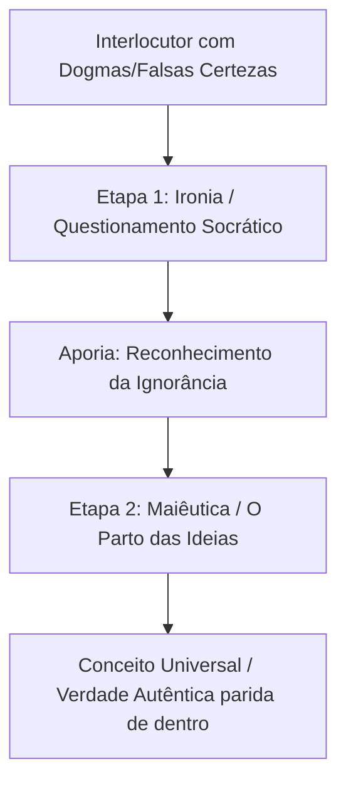

# Curso Mestre dos Pensadores

## Capítulo 05: O Parto da Verdade: Sócrates, o Autoconhecimento e a Arte da Maiêutica

---

### 1. O Gancho & Título Encantador

Imagine caminhar pelas ruas ensolaradas e barulhentas de Atenas no século V a.C. No mercado público, a Ágora, você se depara com um homem de aparência incomum: pés descalços, veste um manto simples e surrado, tem olhos salientes e um nariz chato e largo. Ele não está vendendo mercadorias, nem discursando sobre política. Em vez disso, ele está parado diante de um general famoso de Atenas, fazendo-lhe uma pergunta aparentemente simples: *“O que é a coragem?”*. 

O general, com um sorriso condescendente, responde de pronto: *“Coragem é nunca recuar diante do inimigo no campo de batalha”*. O homem de olhos de sapo agradece a resposta, mas faz uma réplica sutil: *“Mas e se o general ordenar uma retirada estratégica para emboscar o inimigo e vencer a batalha? Recuar nesse caso não seria um ato de inteligência e coragem?”*. O general hesita, tenta formular uma nova definição, mas é confrontado por uma série de outras perguntas lógicas do feio ateniense. Em poucos minutos, o orgulhoso guerreiro se vê enredado em suas próprias contradições, sem saber o que de fato significa a palavra com a qual construiu sua carreira.

Este homem era **Sócrates**. Ele não foi um filósofo que escreveu livros ou construiu sistemas teóricos abstratos. Sua filosofia era uma atividade viva, um esporte de combate intelectual que acontecia nas ruas. Sócrates agia como o "tábão" (um moscardo ou inseto incômodo) que picava o cavalo preguiçoso de Atenas para tirá-lo de sua apatia espiritual. 

Neste capítulo, exploraremos a figura de Sócrates e o seu revolucionário método de investigação: a **Maiêutica** (a arte de partejar as ideias). Descobriremos por que a verdadeira sabedoria não consiste em acumular respostas prontas, mas em ter a coragem de purgar a mente de todas as falsas certezas.

---

### 2. O Cenário & Contexto Histórico

Para compreender a missão de Sócrates, precisamos nos situar em Atenas na segunda metade do século V a.C. — a chamada "Idade de Ouro" ou a época da **Democracia de Péricles**. Após a vitória militar sobre os invasores persas, Atenas havia se tornado o centro cultural, financeiro e político do mundo grego. 

A democracia ateniense era direta: os cidadãos tomavam as decisões políticas debatendo e votando diretamente na Assembleia (*Eclésia*). Nesse sistema político, a habilidade de falar em público, persuadir os outros e vencer debates tornou-se a chave mestra para o sucesso, o poder e a riqueza.

Foi nessa atmosfera que surgiram os **Sofistas**. Eles eram intelectuais e professores itinerantes de retórica e oratória que cobravam altas taxas para treinar os filhos da elite ateniense na arte da persuasão. Para os sofistas (como Protágoras e Górgias), a verdade absoluta não existia; a realidade era relativa e subjetiva. Protágoras cunhou a famosa máxima: *"O homem é a medida de todas as coisas"*. Para os sofistas, não importava se um argumento era verdadeiro ou justo, mas sim se ele era capaz de persuadir a audiência e vencer o debate.

Sócrates (470–399 a.C.), filho de um escultor (Sofronisco) e de uma parteira (Fenareta), posicionou-se como o maior adversário dos sofistas. Ao contrário deles, Sócrates:
- Não cobrava por suas conversas (vivia na pobreza voluntária).
- Afirmava não ter sabedoria alguma para vender ou transmitir.
- Acreditava firmemente na existência de verdades universais e valores morais objetivos (como a justiça, o bem e a virtude) que podiam ser descobertos pela razão humana.

Sócrates via o relativismo dos sofistas como uma doença moral que ameaçava corromper a alma dos cidadãos e destruir as bases éticas da democracia.

---

### 3. O Coração da Obra (Mergulho Profundo)

#### O Oráculo de Delfos e a Ironia Socrática
A jornada filosófica consciente de Sócrates teve início com um veredicto enigmático do Oráculo de Apolo na cidade de Delfos. Um amigo de Sócrates, Querofonte, viajou ao templo e perguntou à sacerdotisa se havia no mundo algum homem mais sábio do que Sócrates. A resposta do oráculo foi direta: *Não há homem mais sábio do que Sócrates*.

Ao receber a notícia, Sócrates ficou perplexo. Ele tinha plena consciência de suas próprias limitações intelectuais e de sua falta de conhecimento sobre os mistérios do universo. Ele pensou: *"Como posso ser o mais sábio se sei que nada sei?"*. 

Para decifrar o mistério, Sócrates decidiu testar a afirmação do oráculo. Ele passou a interrogar os homens que tinham reputação de serem sábios em Atenas: os políticos, os poetas e os artesãos. No entanto, após conversar com eles, Sócrates chegou a uma conclusão melancólica:
- Aqueles homens acreditavam saber muitas coisas profundas, mas, sob investigação, revelavam não saber nada além de dogmas e opiniões sem fundamento.
- Sócrates, por sua vez, também não sabia de nada, mas, diferentemente deles, **tinha consciência da sua própria ignorância**.

Sócrates compreendeu a mensagem do oráculo: ele era o mais sábio de Atenas porque era o único que reconhecia a própria falta de sabedoria. Esse reconhecimento é a base da **Ironia Socrática** (a atitude de fingir ignorância para expor a falsa sabedoria dos interlocutores) e o ponto de partida indispensável para qualquer busca real pela verdade.

#### O Método Socrático: Da Ironia à Maiêutica
O método de investigação socrática (conhecido como *Elenchos* ou refutação) é um diálogo estruturado que se desenrola em duas etapas fundamentais:

##### 1ª Fase: A Ironia (A Desconstrução)
Nesta fase, Sócrates aproxima-se do interlocutor declarando-se um discípulo ansioso por aprender. Ele pede uma definição para um conceito moral básico (por exemplo: "O que é a justiça?"). O interlocutor apresenta uma definição baseada no senso comum ou em convenções sociais. 

Sócrates, então, começa a fazer perguntas em série. Ele aponta exceções e contradições lógicas na resposta dada, obrigando o interlocutor a refazer sua definição várias vezes. Eventualmente, o interlocutor atinge a **Aporia** — um estado de perplexidade, um beco sem saída intelectual onde ele percebe que a sua suposta sabedoria era apenas um castelo de cartas de preconceitos e opiniões superficiais (*Doxa*). 

Para Sócrates, a aporia é terapêutica: a mente precisa ser limpa das falsas certezas antes de poder receber a verdade, assim como um terreno precisa ser limpo de entulhos antes que se possa construir uma casa sobre ele.

##### 2ª Fase: A Maiêutica (O Parto das Ideias)
Uma vez que o interlocutor se livrou do orgulho intelectual e admitiu sua ignorância, inicia-se a segunda fase. Sócrates batizou essa etapa de **Maiêutica** (que em grego significa "a arte do parto"), em homenagem à profissão de sua mãe, a parteira Fenareta.

Sócrates dizia que sua função era semelhante à de uma parteira, com algumas diferenças cruciais:
- A parteira grega ajudava a dar à luz corpos físicos; Sócrates ajudava a dar à luz **ideias e verdades na alma dos homens**.
- As parteiras realizavam o parto em mulheres que já estavam grávidas de um bebê; Sócrates realizava o parto em almas que já estavam "grávidas" da verdade.
- Sócrates considerava-se "estéril" de sabedoria; ele não ensinava verdades ou injetava conhecimento na mente do outro. O seu papel limitava-se a fazer as perguntas corretas para que o próprio interlocutor extraísse a verdade que já residia no fundo de sua própria razão racional.

A maiêutica baseia-se na premissa de que a verdade sobre o bem, a justiça e a virtude não é algo externo a ser decorado, mas uma luz racional inerente à própria alma humana. O diálogo filosófico é o processo de trazer essa luz à consciência.

#### O Julgamento e a Morte de Sócrates
A atividade interrogativa de Sócrates não agradou a todos. Ao expor publicamente a ignorância e a hipocrisia de figuras poderosas e influentes de Atenas (políticos, juízes, oradores), Sócrates acumulou inimigos influentes. 

No ano de 399 a.C., após a derrota de Atenas na Guerra do Peloponeso e sob uma atmosfera de instabilidade política e paranoia, Sócrates foi levado a julgamento. As acusações formais eram de caráter religioso e moral:
1.  Não reconhecer os deuses tradicionais da cidade.
2.  Introduzir novas divindades (*daimonion*).
3.  **Corromper a juventude** de Atenas, ensinando-a a questionar a autoridade das leis e dos pais.

No tribunal (relatado brilhantemente por seu discípulo Platão na obra *Apologia de Sócrates*), Sócrates recusou-se a usar de retórica apelativa, a chorar ou a implorar por misericórdia, como era costume. Ele defendeu sua missão filosófica como um mandato divino irrecusável e declarou que: *"Uma vida não examinada não vale a pena ser vivida"*.

Condenado à morte por uma margem estreita de votos, Sócrates recusou os planos de fuga organizados por seus discípulos ricos (como relata o diálogo *Críton*), argumentando que o cidadão deve respeitar as leis de sua cidade (*Nomos*) mesmo quando estas são aplicadas de forma injusta contra ele. Ele passou suas últimas horas discutindo a imortalidade da alma com seus amigos mais íntimos, antes de beber com serenidade absoluta o veneno extraído da planta **cicuta**.

---

### 4. Galeria Mental & Prompts Ilustrativos

#### Descrição 1: A Arte do Parto das Ideias (Maiêutica)
Uma cena íntima e dramática em uma oficina de escultura grega à noite. Um Sócrates maduro e de traços marcantes, esculpindo um bloco de mármore sob a luz suave de uma lamparina a óleo, aponta com serenidade para o peito de um jovem discípulo que segura um cinzel. A luz dourada da chama ilumina o rosto concentrado do jovem, sugerindo a verdade sendo extraída de dentro de sua própria mente, em meio a sombras profundas e poeira de mármore brilhando no ar. Estilo de pintura digital dramática com forte contraste de claro-escuro no estilo de Rembrandt. Tons quentes de dourado e sombras profundas em azul-marinho. Sem texto.

#### Descrição 2: Prompt de Geração de Imagem (Midjourney / DALL-E 3)
> "A dramatic, atmospheric scene depicting the death of Socrates. Socrates sits on the edge of his stone prison bed, holding a small clay cup of hemlock in one hand while gesturing toward the heavens with his other hand, teaching his grief-stricken disciples. Plato sits silently at the foot of the bed, head bowed. The room is dark, illuminated by a single, dramatic shaft of sunlight coming from a high window, casting deep shadows in a style reminiscent of Caravaggio's paintings. Warm stone textures, flowing ancient Greek drapery, emotional expressions of sorrow on the disciples' faces. 8k, photorealistic historical realism."

---

### 5. Frases de Impacto & O Que Elas Realmente Significam

> "Só sei que nada sei."

**O que realmente significa:** Esta frase (que resume o espírito socrático) não é uma declaração de ignorância cínica ou preguiça mental. É a constatação epistemológica de que nossas certezas absolutas sobre o mundo e a moral são quase sempre ilusórias. O reconhecimento sincero do limite do próprio conhecimento é o único solo de onde pode brotar o verdadeiro desejo de aprender e pesquisar. É a vacina definitiva contra o dogmatismo intelectual.

> "Uma vida não examinada não vale a pena ser vivida."
> — *Apologia de Sócrates*

**O que realmente significa:** Viver sem refletir sobre o significado de nossas ações, valores e escolhas é o equivalente a viver no piloto automático, como animais agindo por puro instinto ou marionetes manipuladas pelas pressões sociais. A característica que define a dignidade humana é a nossa capacidade de autoexame consciente. A filosofia não é um passatempo acadêmico; é o próprio fundamento de uma vida humana digna de ser vivida.

> "Conhece-te a ti mesmo e conhecerás o universo e os deuses."
> — *Inscrição no Templo de Delfos (adotada por Sócrates)*

**O que realmente significa:** O caminho para a verdade e a transcendência não passa pela exploração de terras exóticas ou pelo acúmulo de fatos externos sobre o mundo físico. O segredo da realidade está oculto nas estruturas de nossa própria alma e consciência. Ao examinar a própria mente e compreender as leis morais e racionais internas, descobrimos as chaves que explicam todo o funcionamento do cosmos.

---

### 6. Paralelos com o Mundo Atual (A Filosofia na Prática)

O século XXI ressuscitou os sofistas sob novos mantos tecnológicos. Hoje, os **algoritmos das redes sociais**, os assessores de marketing digital, os *influencers* e os especialistas em relações públicas são os novos mestres da retórica sofística. Eles dominam a arte de capturar nossa atenção e nos convencer a adotar opiniões instantâneas, não porque elas sejam verdadeiras ou justas, mas porque elas geram engajamento, cliques e lucro.

Vivemos sob a ditadura da **opinião rápida** (*Doxa*). Nas seções de comentários do Twitter/X, do Instagram ou do YouTube, as pessoas debatem de forma furiosa sobre temas complexos (política, economia, vírus, inteligência artificial) com uma confiança absoluta baseada em manchetes rasas. Falta a Atenas digital o tábão socrático que pergunte: *“O que você realmente quer dizer com essa palavra?”*.

A maiêutica socrática é mais necessária do que nunca para a nossa sobrevivência intelectual. Praticar o método socrático hoje significa:
1.  **Questionar a própria bolha:** Fazer um autoexame implacável sobre as nossas opiniões políticas e sociais favoritas, perguntando-nos: "De onde veio essa certeza? Tenho evidências lógicas para sustentá-la ou apenas a repito para ser aceito pelo meu grupo?".
2.  **Escuta ativa e diálogo reflexivo:** Em vez de debater com o outro com o único objetivo de vencer a discussão (retórica sofística), usar perguntas honestas para ajudar o interlocutor e a nós mesmos a esclarecer o real significado dos conceitos em discussão.
3.  **Humildade intelectual:** Aceitar o desconforto terapêutico de admitir um "não sei" diante de temas complexos que exigem estudo sério, em vez de fingir sabedoria instantânea.

---

### 7. Curiosidades e Bastidores

*   **A Beleza Escondida:** Sócrates era frequentemente comparado pelos atenienses às estátuas de Sileno (divindades da floresta associadas a Dionísio, representadas como velhos feios, gordos e bêbados). No entanto, essas estátuas de argila eram ocas e, quando abertas, revelavam imagens douradas e requintadas de deuses em seu interior. Essa imagem ilustra a discrepância entre a feiura física externa de Sócrates e a beleza espiritual e racional radiante de sua alma.
*   **O Soldado de Ferro:** Sócrates lutou como hoplita (soldado de infantaria pesada) em três campanhas militares na Guerra do Peloponeso (Potideia, Delium e Anfípolis). Seus companheiros de batalha relatam que sua resistência física era sobre-humana: ele caminhava descalço sobre o gelo durante o inverno rigoroso, mantinha a serenidade no meio do caos da retirada e salvou a vida do jovem general Alcibíades no campo de batalha.
*   **A "Voz Secreta":** Sócrates afirmava ouvir desde a infância uma voz interna misteriosa que ele chamava de seu *daimonion* (um sinal ou guia divino). Essa voz nunca lhe dizia ativamente o que fazer, mas sempre intervinha para alertá-lo e impedi-lo quando ele estava prestes a tomar uma decisão errada ou perigosa (como entrar na política partidária ativa da cidade).

---

### 8. A Ponte (Conexão com o Próximo Capítulo)

Sócrates transformou a história da filosofia ocidental ao focar sua busca na ética, no autoexame e no diálogo racional pelas ruas de Atenas. Contudo, ao ser executado pela assembleia democrática ateniense, Sócrates deixou um profundo trauma e um dilema insolúvel para seus discípulos: se a democracia, o sistema político mais livre de sua época, foi capaz de condenar à morte o mais justo e sábio de seus cidadãos, então as estruturas do mundo material e da política humana devem ser profundamente imperfeitas e corruptas.

Seu mais brilhante discípulo, um jovem de ombros largos chamado **Platão**, dedicou sua vida a responder a esse dilema. Platão percebeu que, para salvar a memória de Sócrates e encontrar a verdadeira justiça, ele precisaria construir uma vasta teoria que explicasse não apenas as definições éticas de seu mestre, mas a própria natureza da realidade universal.

Platão proporá que os conceitos perfeitos que Sócrates buscava (a Justiça em si, a Beleza em si, o Bem em si) não pertencem a este mundo material e impermanente que percebemos com os nossos sentidos. Eles habitam um reino transcendente de pura luz racional: o **Mundo das Ideias**.

No próximo capítulo, entraremos na academia platônica e desvelaremos uma das metáforas mais influentes de todos os tempos: a **Alegoria da Caverna**. Prepare-se para descobrir se você está vivendo na realidade de luz ou se está apenas assistindo a sombras projetadas na parede de uma caverna escura.

---

### 9. Quiz de Fixação e Reflexão

#### Perguntas de Múltipla Escolha

1. **Qual foi a resposta dada pelo Oráculo de Delfos ao amigo de Sócrates sobre quem seria o homem mais sábio do mundo?**
   * A) Que o rei Péricles era o mais sábio devido ao seu poder político.
   * B) Que os sofistas eram os mais sábios porque sabiam ensinar a arte da retórica.
   * C) Que não havia ninguém no mundo mais sábio do que Sócrates.
   * D) Que os poetas trágicos gregos detinham a sabedoria suprema.

2. **O método socrático da Maiêutica é inspirado na profissão da mãe de Sócrates e consiste em:**
   * A) Ensinar técnicas de memorização rápida para jovens vestibulandos.
   * B) Fazer perguntas para ajudar o interlocutor a dar à luz verdades racionais que já residem dentro dele.
   * C) Escrever discursos persuasivos para convencer os juízes nos tribunais.
   * D) Estudar a reprodução biológica e a obstetrícia nas colônias gregas.

3. **Quem eram os Sofistas, principais opositores de Sócrates na Atenas clássica?**
   * A) Sacerdotes do templo de Delfos responsáveis por interpretar os oráculos divinos.
   * B) Cientistas da natureza que estudavam a física e a origem material do cosmos.
   * C) Professores itinerantes de retórica que cobravam para ensinar a arte da persuasão política, defendendo o relativismo da verdade.
   * D) Escultores de mármore que construíram os templos do Partenon.

4. **Por que Sócrates aceitou a sua sentença de morte por envenenamento por cicuta em vez de fugir da prisão com a ajuda de seus amigos?**
   * A) Porque ele estava cansado de viver e sofria de depressão profunda.
   * B) Porque ele considerava que a fuga confirmaria que ele era de fato um traidor da pátria.
   * C) Em respeito às leis da cidade (*Nomos*), pois defendia que o cidadão deve obedecer ao pacto social mesmo quando a lei é aplicada injustamente.
   * D) Porque ele acreditava que o veneno seria curado milagrosamente por Apolo.

#### Gabarito Comentado

1. **Alternativa Correta: C) Que não havia ninguém no mundo mais sábio do que Sócrates.**
   * *Justificativa:* O oráculo surpreendeu Sócrates ao declará-lo o homem mais sábio, forçando-o a investigar o significado dessa afirmação através de diálogos com os cidadãos de Atenas.
2. **Alternativa Correta: B) Fazer perguntas para ajudar o interlocutor a dar à luz verdades racionais que já residem dentro dele.**
   * *Justificativa:* A maiêutica é "o parto das ideias". Sócrates ajudava o interlocutor a formular ativamente conceitos universais ocultos na própria razão, em vez de transferir conhecimentos prontos de forma passiva.
3. **Alternativa Correta: C) Professores itinerantes de retórica que cobravam para ensinar a arte da persuasão política, defendendo o relativismo da verdade.**
   * *Justificativa:* Os sofistas focavam na eficácia do discurso político pragmático e não na busca da verdade objetiva, cobrando alto por esse ensinamento prático.
4. **Alternativa Correta: C) Em respeito às leis da cidade (*Nomos*), pois defendia que o cidadão deve obedecer ao pacto social mesmo quando a lei é aplicada injustamente.**
   * *Justificativa:* No diálogo *Críton*, Sócrates argumenta que destruir as leis da cidade escapando clandestinamente seria uma ingratidão contra a pátria que o gerou e educou. Sua ética exigia integridade e coerência cívica até o fim.

#### Pergunta Aberta de Provocação Filosófica
Reflita sobre uma opinião ou valor que você defende com unhas e dentes no seu cotidiano (pode ser uma convicção política, uma regra moral pessoal ou uma certeza profissional). Se Sócrates o encontrasse hoje na praça pública digital, qual seria a primeira pergunta que ele faria a você para testar a solidez dessa sua certeza? O que aconteceria se você admitisse que, na verdade, *"só sei que nada sei"* sobre esse assunto específico?
