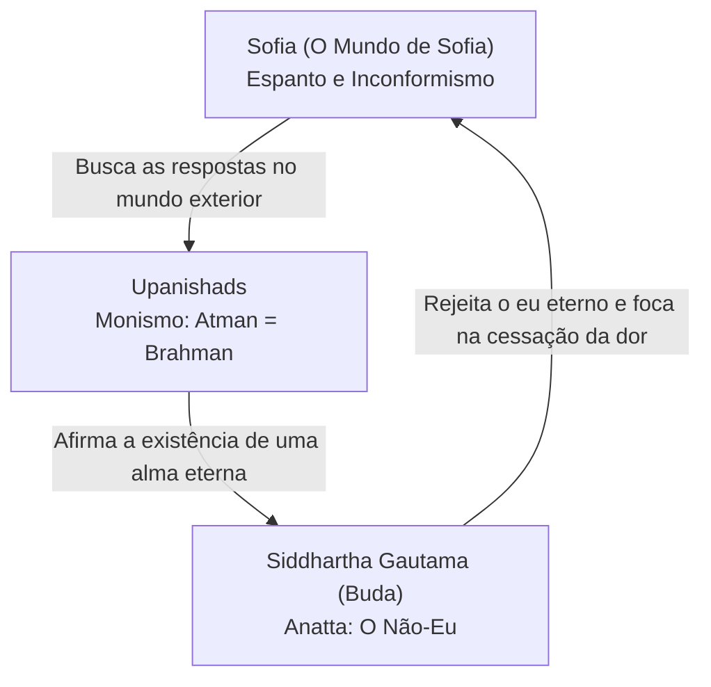

# Curso Mestre dos Pensadores

## Capítulo de Síntese: Módulo 1 — Abertura e Fundamentos da Filosofia

---

### 1. O Encontro no Limiar do Despertar

Nas primeiras páginas da nossa jornada, fomos confrontados com o espanto. Uma carta anônima perguntava a uma menina de 14 anos: *"Quem é você?"* e *"De onde vem o mundo?"*. O Mundo de Sofia nos ensinou que o verdadeiro filósofo é aquele que se recusa a se habituar com o mundo — aquele que se agarra aos pelos do coelho cósmico para olhar nos olhos do Mago que faz o truque.

Mas o que acontece quando esse espanto ocidental, racional e curioso viaja em direção ao Oriente antigo?

Neste Capítulo de Síntese, colocamos em diálogo as três primeiras paradas do nosso curso magistral:
1. **O Mundo de Sofia** (Jostein Gaarder) — O espanto filosófico ocidental e a busca pelas perguntas.
2. **Os Upanishads** (Sabedoria Védica) — A descoberta de que o observador e o cosmos são um só (**Atman é Brahman**).
3. **Siddhartha Gautama** (Buda) — A desconstrução de toda ilusão de permanência (**Anatta** e as **Quatro Nobres Verdades**).

Se Sofia é a criança curiosa na cartola do Mago, o sábio dos Upanishads é aquele que percebe que a cartola, o coelho, o Mago e a própria Sofia são feitos da mesma substância única. E o Buda? O Buda é aquele que nos aconselha a descer da cartola inteiramente, pois perceber que a cartola está pegando fogo é o início da verdadeira libertação.

---

### 2. Recapitulação Cruzada: Três Caminhos para uma Mesma Pergunta

A pergunta central de Sofia — *"Quem é você?"* — recebe respostas radicalmente diferentes, mas profundamente conectadas, em cada uma dessas tradições:

#### O Espanto de Sofia: A Pergunta como Fim em Si Mesma
Para a filosofia ocidental que Gaarder introduz, a saúde da mente é a capacidade de continuar perguntando. O perigo não é o erro, mas a **apatia** — o hábito que nos faz aceitar a realidade como óbvia. O filósofo é o eterno inconformado. A resposta para "Quem é você?" é uma busca intelectual contínua, uma jornada que usa a razão como ferramenta de exploração do mundo exterior e interior.

#### O Monismo dos Upanishads: A Resposta Absoluta
Os Upanishads respondem à pergunta de Sofia com uma audácia metafísica sem precedentes: *"Tat Tvam Asi"* (Tu és isso). Quem é você? Você não é o seu corpo, nem suas emoções, nem sua história pessoal. Você é **Atman**, a consciência pura que testemunha todas as coisas. E esse Atman é idêntico a **Brahman**, o absoluto cósmico. O espanto diante do mundo exterior resolve-se quando você percebe que o universo não é "outro" — ele é a sua própria natureza mais profunda. O mundo que Sofia observa é **Maya** (ilusão), um véu de separação que se dissolve quando o eu individual se reconhece na totalidade.

#### O Vazio do Budismo: A Dissolução da Resposta
Siddhartha Gautama dá um passo além. Ele olha para a afirmação dos Upanishads sobre o Atman e diz: não há Atman. Não existe um "eu" permanente, nem individual, nem cósmico. O que chamamos de "eu" é uma ilusão cognitiva produzida pela combinação transitória de cinco agregados (**Skandhas**). A busca por um "eu" permanente é a raiz de todo o sofrimento (**Dukkha**), porque tentamos encontrar estabilidade em um cosmos onde tudo é impermanente (**Anicca**). A libertação (**Nirvana**) não é a união do eu com o cosmos, mas a extinção da própria ilusão de que existe um eu a ser unido.

---

### 3. Tensões e Concordâncias: O Embate das Ideias

#### Tensão 1: Preservar a Individualidade vs. Dissolver o Eu
- **Sofia/Ocidente**: Valoriza a individualidade. O sujeito racional deve explorar o mundo, aprender, crescer e construir sua história. O espanto requer um "eu" que se espanta.
- **Upanishads/Budismo**: Vêem a apego à individualidade como a raiz da ilusão e da dor. Para os Upanishads, a meta é a fusão do Atman no Brahman (Moksha); para o Budismo, é a extinção da ilusão do eu (Nirvana).

#### Tensão 2: O Ser (Brahman) vs. O Devir (Anicca)
- **Upanishads**: Existe uma realidade última, eterna, imutável e perfeita por trás de todas as aparências: Brahman. A mudança é ilusória (Maya).
- **Budismo**: Não existe nada imutável. A única constante é a mudança (Anicca). Até mesmo a busca por um Brahman eterno é uma tentativa do ego de escapar da impermanência.

#### Concordância Fundamental: O Despertar do Sono Social
Os três pensamentos concordam que a maioria da humanidade vive em um estado de "sono acordado". Para Gaarder, as pessoas de classe média perderam a capacidade de se espantar; para o hinduísmo, estamos cegos por Maya; para o budismo, estamos sob o domínio de *Avidya* (ignorância). Despertar é a meta de todos.

---

### 4. Quadro-Resumo Comparativo

| Tema | O Mundo de Sofia (Ocidente) | Upanishads (Hinduismo) | Siddhartha Gautama (Buda) |
| :--- | :--- | :--- | :--- |
| **A Natureza do Eu** | O sujeito racional e curioso que se recusa a aceitar o óbvio. | **Atman**: A alma eterna e imutável que testemunha o cosmos. | **Anatta**: O não-eu; o eu como construção transitória dos agregados. |
| **O Diagnóstico da Dor** | A apatia intelectual, o conformismo e a perda do espanto. | A ignorância (*Avidya*) que nos faz ver separação onde há unidade. | **Dukkha**: Sofrimento causado pelo apego e pela ilusão de permanência. |
| **A Solução / Meta** | A vida examinada, a curiosidade eterna e a busca pela verdade. | **Moksha**: A libertação através da união entre Atman e Brahman. | **Nirvana**: A extinção do desejo, do apego e da ilusão do eu. |
| **A Origem do Mundo** | Uma pergunta a ser investigada cientificamente e filosoficamente. | Emanação de **Brahman** através do jogo cósmico (*Lila*). | Uma questão irrelevante para a cura do sofrimento (a flecha envenenada). |

---

### 5. Debate Cruzado: O Diálogo Imaginário

**Cenário**: *Um jardim nos arredores de Atenas. Sofia Amundsen está sentada sob uma oliveira com seu caderno. Ao seu lado, um sábio védico dos Upanishads medita sob uma árvore Bodhi transposta, enquanto Siddhartha Gautama, vestido com vestes cor de açafrão, observa a água de um pequeno lago.*

**Sofia**: Eu recebi uma pergunta ontem que me deixou sem dormir: "Quem é você?". Eu acho que sou Sofia, mas sei que isso é apenas meu nome. Eu sou a minha mente? Sou o que penso? Mas de onde vêm os meus pensamentos?

**Sábio do Upanishad**: Minha jovem amiga, sua mente é como as ondas no topo do oceano. Você olha para as ondas e diz "esta sou eu, e aquela ali é outra". Mas toda onda é apenas o oceano em movimento. Quem é você? Você é a consciência silenciosa por trás dos seus pensamentos. Você é Atman. E esse Atman não é diferente do céu acima de nós ou do lago à sua frente. *Tat Tvam Asi*. Você é o Todo.

**Buda**: *[Sorri suavemente e joga uma pedra no lago, observando as ondulações]* Se me permitem... O sábio fala do oceano como se ele fosse permanente. Mas onde está esse "oceano" quando as águas evaporam? Onde está o "eu" quando os pensamentos cessam no sono profundo? O Atman do qual você fala é apenas a última e mais sutil âncora que o ego cria para não ter que aceitar que é vazio. Quem é você, Sofia? Você é um fluxo constante de sensações, percepções e pensamentos que surgem e desaparecem. Não procure por uma alma eterna. Apenas observe como tudo muda. Quando você parar de procurar por um eu eterno, a dor de não encontrá-lo desaparecerá.

**Sofia**: Mas se eu não tenho um eu, como o senhor diz, Buda, então quem é que está se espantando aqui? Quem é que está fazendo as perguntas? E se tudo é um só, como você diz, sábio, por que o mundo parece tão cheio de injustiça e separação real?

**Sábio do Upanishad**: O mundo parece separado por causa de *Maya*, a ilusão da dualidade. A dor surge quando a onda se esquece de que é oceano e teme colidir com outras ondas. A injustiça é real no nível das aparências, mas no nível da verdade última, tudo está em perfeito equilíbrio cósmico.

**Buda**: Se a casa está pegando fogo, sábio, não passamos tempo debatendo se o fogo é ilusório ou se a substância do fogo é divina. Nós corremos para fora da casa. A especulação metafísica sobre Brahman ou sobre a origem do mundo é como um homem ferido por uma flecha envenenada que se recusa a retirá-la antes de saber o nome do arqueiro, sua casta e o tipo de madeira da flecha. Ele morrerá antes de obter as respostas. Minha preocupação não é o absoluto — é a dor real de Sofia e como curá-la.

---

### 6. Quiz Comparativo de Fixação

**Questão 1 — Múltipla Escolha:**
Qual dessas afirmações melhor resume a divergência entre os Upanishads e o Budismo sobre a natureza do "Eu"?
- A) O Budismo afirma que o Eu é idêntico a Deus; os Upanishads negam a existência de Deus.
- B) Os Upanishads afirmam a existência de uma alma eterna e imutável (Atman); o Budismo afirma que não há um eu permanente (Anatta).
- C) Ambos concordam que o eu individual é a única realidade existente e imutável.
- D) O Budismo defende o egoismo ético; os Upanishads defendem o altruísmo radical.

**Gabarito:** B. Os Upanishads sustentam a doutrina do Atman (a alma eterna), enquanto o Budismo responde com a doutrina de Anatta (o não-eu).

**Questão 2 — Múltipla Escolha:**
Como Sofia (representando o espanto filosófico ocidental) responderia à parábola do Buda sobre a "flecha envenenada"?
- A) Concordaria plenamente, abandonando todas as perguntas teóricas para focar apenas na meditação.
- B) Discordaria, argumentando que a busca teórica pelas causas do mundo e pela verdade (mesmo que dolorosa) é o que define a dignidade humana.
- C) Diria que a flecha é ilusória e por isso não dói.
- D) Afirmaria que a pergunta "Quem é você?" é fácil de responder.

**Gabarito:** B. A filosofia ocidental valoriza a investigação das causas primeiras (a física, a metafísica) como parte essencial da jornada, recusando-se a abandonar a curiosidade em nome de um utilitarismo terapêutico estrito.

**Aplique o Conceito:**
Você perdeu seu emprego de anos devido a uma reestruturação tecnológica. Você se sente perdido e sem rumo, sentindo que sua identidade foi arrancada. Como a sabedoria do Módulo 1 ajudaria você a lidar com essa situação?
- *Perspectiva dos Upanishads*: Lembraria que seu cargo de trabalho e sua carreira eram apenas manifestações de Maya. Seu verdadeiro eu (Atman) permanece inalterado, pois a consciência pura não depende de funções sociais.
- *Perspectiva do Buda*: Apontaria que seu sofrimento vem do apego a uma identidade profissional impermanente (Anicca). Aceitar que a carreira não define seu ser (Anatta) é o primeiro passo para a paz mental.

**Verdadeiro ou Falso — Pegadinha:**
*"O Budismo e o Hinduísmo dos Upanishads são exatamente a mesma filosofia, apenas com nomes diferentes para os mesmos conceitos."*

**Falso.** Embora compartilhem termos comuns (Samsara, Karma, Maya), a discordância sobre a existência de uma alma eterna (Atman vs. Anatta) é uma das maiores divisões metafísicas da história do pensamento, gerando caminhos práticos e filosóficos radicalmente distintos.

---

### 7. Debate a Dois (Para Casais)

*O Mundo de Sofia nos convida ao espanto; as Upanishads nos chamam à união total; o Budismo nos lembra da impermanência de todas as coisas.*

**Pergunta para o casal**:
No relacionamento de vocês, qual de vocês representa mais frequentemente o papel de "Sofia" (aquele que questiona, que busca novidade, que se espanta e quer discutir as bases da relação) e quem representa mais o papel do "Buda/Upanishads" (aquele que busca estabilidade, aceitação da realidade como ela é, paz e equanimidade)?

Como vocês equilibram o **espanto e a curiosidade** necessários para não deixar a relação cair na apatia com a **paz e a aceitação** necessárias para suportar as flutuações e impermanências da vida a dois?

---

### 8. Glossário Cumulativo do Módulo 1

- **Atman**: A alma individual no pensamento hindu; a consciência-testemunha interior.
- **Brahman**: A realidade cósmica última no pensamento hindu; o absoluto imutável.
- **Tat Tvam Asi**: "Tu és isso" — mantra védico da identidade entre Atman e Brahman.
- **Maya**: A ilusão cósmica da separação e da multiplicidade.
- **Samsara**: O ciclo infinito de mortes e renascimentos.
- **Moksha**: A libertação do ciclo do Samsara; fusão do eu no Brahman.
- **Dukkha**: Sofrimento, insatisfação ou imperfeição intrínseca da existência (Budismo).
- **Anicca**: A lei da impermanência universal; tudo está em fluxo.
- **Anatta**: A doutrina do não-eu; a inexistência de uma alma ou ego eterno e imutável.
- **Skandhas**: Os cinco agregados transitórios que formam a ilusão da personalidade.
- **Nirvana**: A extinção do desejo e da ilusão do eu; o fim do sofrimento budista.
- **Thaumasia**: O espanto ou assombro que origina o filosofar no Ocidente.
- **Avidya**: Ignorância espiritual que impede o discernimento da verdade.
